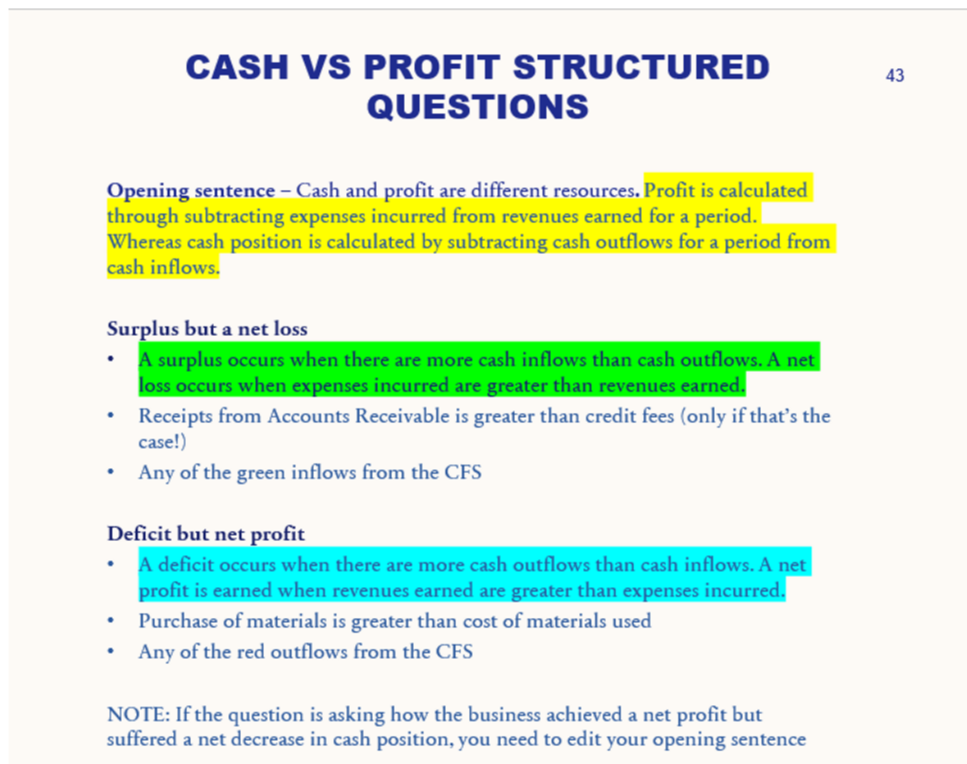

---
---
*chapter 10*
- The difference between cash and profit
    - The structured answers (from class)
    - Net profit but a cash deficit and examples why
    - Net loss but a cash surplus and examples why

Replace
the yellow highlights with other highlighted text depending on question

(which leads to an increase in cash but has no impact on profit) as explanation

|         | Cash flow statment                                                                                                                                      | both                                                                                                                                                | Income statement            |
| ------- | ------------------------------------------------------------------------------------------------------------------------------------------------------- | --------------------------------------------------------------------------------------------------------------------------------------------------- | --------------------------- |
| Inflow  | GST refund Gst received Receipts from   accounts receivable Sale of NCA Capital   contribution Receipt of loan   (or Loan)      | Cash fees Interest received Cash prize                                                                                                        | Credit fees                 |
| Outflow | Payments to   accounts payable Gst Settlement Gst paid Purchase of NCA Purchase of   materials/supplies Drawings Loan repayment | Wages Advertising Utilities • Rent • Electricity • Water • Phone bill • Car expenses Interest on   loan/interest expense | Cost of materials   used |

[Also see here](../../Glossary/0.%20Theory%20bank/4.%20Cash%20vs%20profit)