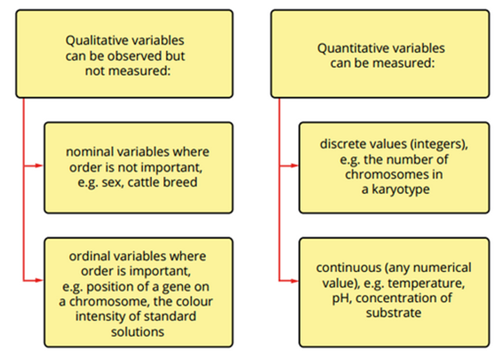

---
---
## Quantitative data
💡 Must show **units**.

- **Objective**.
- numerical, **Measurable** quantity.
- Can be discrete or continuous.
    - E.g. Length (e.g. distance of planets), mass (e.g. weight of sumo wrestlers), time (e.g. duration of red lights), height (e.g. height of year 11s)
- line graph is used for quantitative continuous data  
- bar chart is used for discrete/categorical data
## Qualitative data
💡 **Descriptive** rather than numerical.
- observable but not measurable
- **Subjective**.
- Often grouped into categories.
    - E.g. eye colour, type of music, brand of phone, mood, texture (rough/smooth)

*source: unknown*

|                   | Qualitative                          | Quantitative                                                                                                           |
| ----------------- | ------------------------------------ | ---------------------------------------------------------------------------------------------------------------------- |
| **Advantages**    | easier faster cheaper to collect     | easier to compare and analyse between experiments because can say like this is the avg this is the mean and compare |
| **Disadvantages** | much harder to compare subjective | usually more expensive, longer to plan and carry out experiment                                                        |

---
**Primary data** is you are collecting data from your own experiment
**Secondary** from another source

- in epi important to have secondary data to support primary data
- How much data do you need to collect? 5 x 5 rule? (Good experiments are **repeatable & reproducible**)