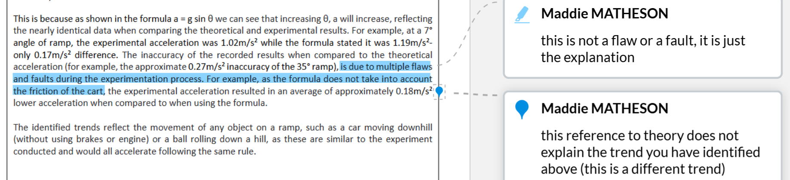

---
---
Rubric

- Description and explanation of trends
    - *Clearly and correctly describing and explaining the trends observed from the results, with specific reference to data throughout your response. 4 marks*
    - Comments that clearly and correctly state, describe and explain all of the trends (PLURAL) in the data. **Reference to the data is made** to support these comments and the correct terminology is also used through explanations.
    - Comments provide a description of trends visible in the data which are supported by specific data from the results.
    - Trends in data are appropriately presented, Description of trends is included with reference to specific values
    - Accurate trends in the data are described with numeric values
    - use of actual data values as evidence for discussion
    - (Bio) Description of data
        - comprehensive evaluation of findings including description of trends that accurately refer to the graph and data from IV and DV.
        - Includes comments on precision and repeatability of data.
        - Evaluation of optimal conditions, and for the context of the experiment (eg saturation or maximum rates)
        - Identification of outliers and their treatment
- Links to theory and explanations
    - *Making links between the identified trends and the relevant scientific principles that have been researched/studied, with specific reference to data throughout your response. 3 marks*
    - Links are made between the identified trends and the relevant scientific principles that have been researched/studied. Specific data has also been highlighted to support these statements.
    - Links between identified trends and relevant scientific principles have been described and supported by specific data from the results
    - links between identified trends and relevant scientific principles
    - implications of the results and observations
    - (Bio) Evaluation of data
        - Evaluation of findings including explanation of the trends/data that links the IV and DV
        - links provided between theory and achieved data/results
    - links to the hypothesis and background information
        - Identify if results support/ partly support or refute the hypothesis
- Link to an everyday situation
    - *Creating a link between the experiment you conducted and the data obtained to an everyday situation.1 mark*
    - A link to an everyday situation has been made.
    - A link to an everyday situation has been made
- Errors, limitations and improvements
    - *Identifying {two} errors from the experiment with an explanation of how these would have impacted upon the results and providing an appropriate improvement to each of these errors to remove/minimise these if the experiment was to be repeated. 4 marks*
    - Two errors from the experiment have been identified and explained in relation to how these have affected the results. Appropriate improvements to each of these errors has also been provided.
    - Two errors have been identified. Explanation of how errors impacted results provided. Two related improvements have been suggested
    - problems encountered or limitations
    - possible improvements for future investigations
    - a statement of level of confidence in the findings or validity with reference to sources of uncertainty or experimental design
    - (Bio) Limitations, errors, improvements
        - Comprehensive Discussion of the limitations, possible errors (and type) and suggested improvements or recommendations for extending the investigation
- A comprehensive analysis of results has been made with all of the points above addressed to a high standard

Describe all patterns/trends (similarities, etc)

Theoretical was consistently higher than experimental _ by an average of _
The greatest difference was _ and the lowest difer,f.

Why is there a similarity or difference in data
Reference specify data

At least 2 trends then explain them

linear?

For the bio EPi you only need one error and one limitaition. For the error state the type of error an an improvement. Don’t need to expand on limitation, just state it and its cause.

Everyday situation, not make rollercoaster

maybe good to link back to the situation described in the task sheet (if there was one)

# 📝

Construct evidence-based arguments and draw conclusions
Discussion

- This section examines whether the data obtained supports the hypothesis, explores the implications of the findings and judges the potential limitations of the experimental design.
- It focuses on a question of understanding ‘What is the meaning and/or the significance of my investigation results?’
- This involves analysis in explaining what the results clearly indicate, what has been found and what is known with certainty based on results as well as interpretation in explaining the significance of results, identifying ambiguities and further questions that arise, and finding logical explanations for problems in the data.
- In this section, you should:
- Show clearly whether the data supports, partly supports or refutes the hypothesis by stating the relationships or correlations the data indicates between independent and dependent variables. Discuss patterns, trends or relationships in the data.

The relationship between the evidence and the conclusions drawn from the evidence should be made explicit. The terms ‘proved’, ‘disproved’, ‘correct’ or ‘incorrect’ in relation to the hypothesis should be avoided since this level of certainty may be unlikely in a single investigation; terms such as ‘supported’, ‘indicated’ and ‘suggested’ are more appropriate to evaluate the hypothesis.

////////

- Compare expected results with those obtained, analyse experimental design and errors and acknowledge any anomalous data or deviations from what was predicted.
- Ignoring data that contradicts claims or predictions is a departure from scientific method.
- Such data should be acknowledged, examined carefully and, where possible, the procedure should be repeated to obtain further data.
- If replication is not possible then **flaws/errors** in the procedure or investigation design should be identified and you should discuss how and why the procedure or investigation design may have affected the data, and **how the procedure or investigation design could be changed** to eliminate – or **minimise the effects** of – the identified flaws.
- Relate findings to earlier work undertaken in the area under investigation. The investigation will be an extension of previous theoretical understandings and investigations undertaken and these should be discussed in relation to your own data.
- Discuss **limitations** of the investigation design and **suggested improvements** could be summarised, **possible future work that could be done** to refine or extend conclusions could be identified and/or the implications of conclusions could be explained.
---

A discussion should include:

- **Interpret** the **trends** and **patterns** in the data.
    - Refer to a graph if possible, as this will clearly show the relationship between the independent and dependent variables.
    - Quote relevant data from the table or graph when referring to trends in the data.
- **Evaluate** the **trends** and **patterns in the data**.
    - Refer to relevant **biological concepts** to draw meaningful conclusions from results.
- Acknowledge any deviations (**outliers**) in the data.

○Relate the results to the relevant biological theory and key terms.

- State whether the data you collected **supports** or **does not support** the **hypothesis**.
- Identify any **limitations** in the data or the method.
    - Refer to **random** and **systematic** errors.
    - Analyse the quality of data in terms of **accuracy**, **precision**, **validity**, **reliability** and **reproducibility**.
- **Suggest future improvements** to the investigation if it were to be performed again.

○Referring to experimental errors, not personal errors. If your experiment is performed correctly, there should be no personal errors.

- Avoid terms such as ‘proved’, ‘disproved’, ‘correct’ and ‘incorrect’ in relation to your hypothesis, as it is unlikely that you can be this certain from a single investigation. Instead, use terms such as ‘supported’, ‘not supported’, ‘indicated’ and ‘suggested’.

<!-- Make a list of common errors (so can memorise some) -->

good example of a suggestion (high scoring in year 9):

Another error is that the ramp was not placed at exactly the same angle as stated. The protractor app on a phone rounds the angle to the nearest integer. This resulted in a slightly varying acceleration to the theoretical acceleration due to the angle input of the formula being exactly the angle stated in the table. For example, whilst the angle used for the 35° theoretical acceleration was exactly 35°, the actual angle may have been slightly off (eg 34.6°). More advanced angle  measurement tools or software would be required to more accurately measure the angle of decline of the ramp such as a digital level or gauge inclinometer.

<!-- dumb mistakes: (remove comment to check, then add back the comment)

-->