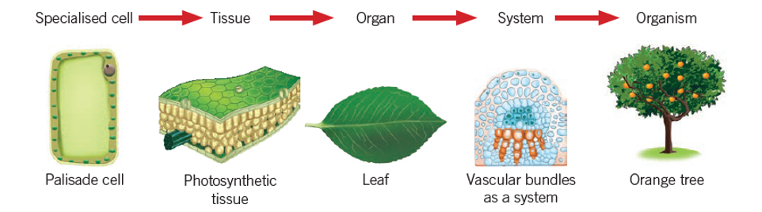

---
---
Specialisation and organisation of plant cells into tissues for specific functions in vascular plants, including intake, movement and loss of water (4E)

*source: unknown*

**Organs in a plant**

-leaves

-root system

-fruit

-flowers

root structure

xylem and phloem

transpiration 

leaf structure

just the flower chapter

compare xylem and phloem, function, structure, etc

lignin,