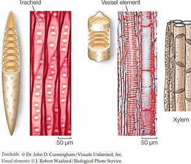

---
---
(in vascular plants, in the stem)

phloem is usually on the outside, and the xylem on the inside.

## Xylem

Only need to know: function

-transports dissolved minerals and water from the roots to the leaves
-also helps plant to stay upright

SPecial elementsof the xylem:

- vessel elements
- tracheids

-these 2 types of cells stack on top each other to form the xylem

-tracheids are found in every (vascular) plant
-vessel elements are found in flowering (vascular) plants

Pits between vessel elements/tracheids allow water to enter/exit the xylem horizontally

fun fact: the outer rings of a trunk are dead xylem, they are only there to provide trunk strength

#### Lignin

a complex carbohydrate

-dead tracheids and vessel elements become **lignified** when they mature, to form hollow hydrophobic tubes. (cell wall becomes lignin (wood))
-located in the cell walls of vascular tissue 
-helps provide structure, prevent plant from tipping over as water moves up

## Phloem

Transports dissolved sugars (produced in the leaves) up and down the plant.

On the outside layer of the vascular bundle.

- Connected **hollow and non-lignified living cells** with **sieve plates** in between (porous, allow food and water to pass)
- Thin cell wall made of cellulose
- Pits between the sieve and companion cells allow water to enter/exit the phloem horizontally
- Companion cells regulate the entry of nutrients into the phloem

fun fact: sap is in the phloem