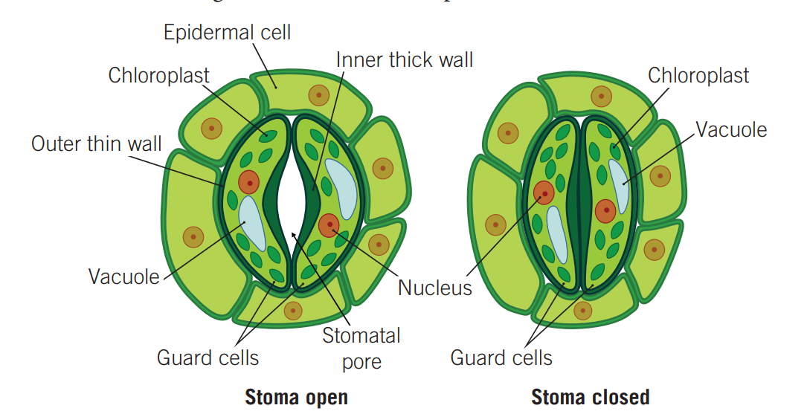
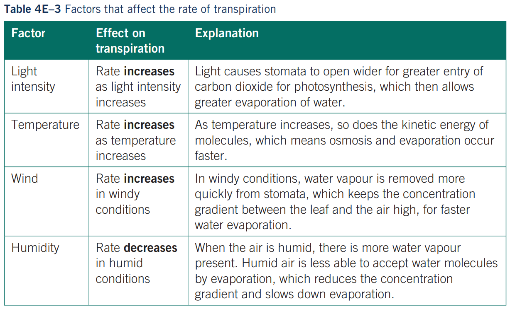

---
---
**The movement of water up the xylem and the evaporation of water via the leaves**

Functions

- transport water from roots
- provide water for photosynthesis
- keeps plant cool, prevent plant from over heating

### How does the stomata affect the rate of transpiration?

*source: unknown*

Note: stomatas are the pores in the stoma

Potassium ions are actively pumped into guard cells which greatly increases solute concentration inside the cell. This makes water flow in to make it turgid.

-when the guard cells are turgis, there is a gap in between, so there is loss of water through transpration

-when they are flaccid no water can get out of the leaves, so the plant can preserve the water in dry conditions

Guard cells open:

- greater transpiration
- greater photosynthesis
    - intake of co2
- greater water loss

-some loss of water is good to cool down the plant, but too much is bad.

It is important for plants to get the right amount of opening the pore. Because they need to open the pore to do photosynthesis (to get carbon dioxide). However this means loss of water.

But if they close the pore they will keep the water but can’t do photosynthesis.

The pores are always closed at night because there is no light so they can’t do photosynthesis

The biggest factor of affecting the rate of transpiration is the amdsount of open stomata\

**Cohesion and adhesion of water**

Cohesion

- because water has slight positive and negatively charged sides, when multiple water are close together they are attracted.
- In a plant this makes the water from the xylem go into the leaves when water is lost

Adhesion

- water sticking to non water
- In plants, water sticks to the xylem
- This is why the edge of the water in the cup rises, because glass is even more magnetic

Other factors

*source: the textbook*

### Summary of how water is consistently transported up the plant

• Water moves into the plansct by **osmosis**, which generates root pressure that forces water
upwards a bit.
• The main upward pull of **transpiration**, water loss from the leaves, draws water through
the xylem up the plant.
• The **adhesion and cohesion** properties of water enable transpiration to pull a continuous
stream of water upwards.