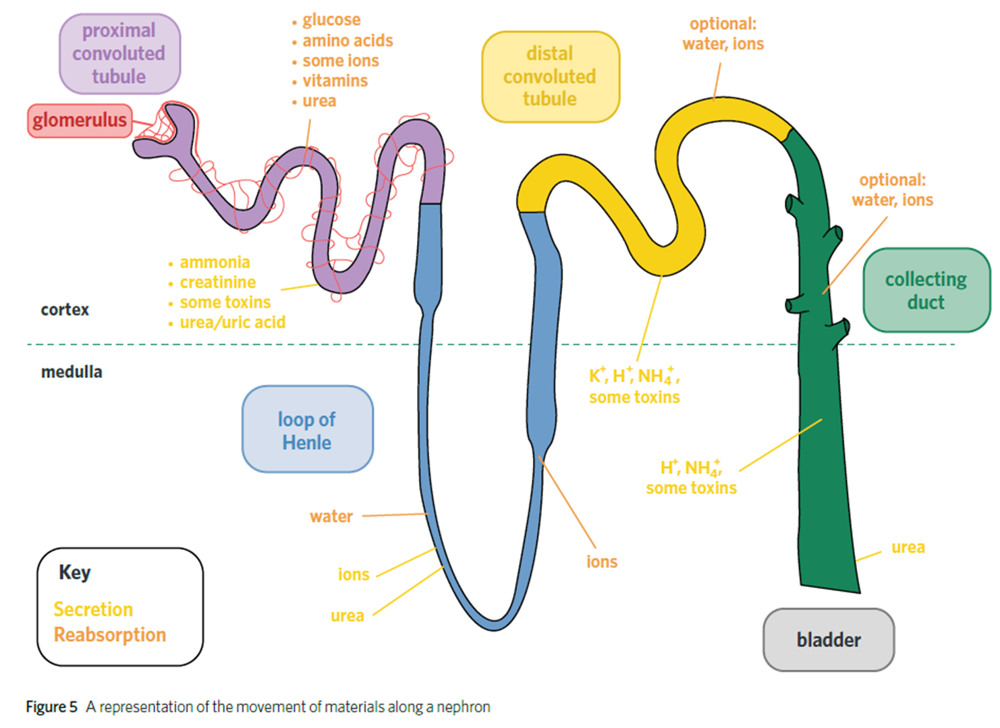

---
---
“to remove excess and unwanted substances from the body and to maintain a stable internal environment”

- protein has amino acids, which the body needs.
- the amino acids cannot be stored, so:
- they are immediately used or:
- transported to liver, where:
- deamination turns the amino acids into ammonia.
- However ammonia is toxic, so:
- it is broken down into urea,
- which is transported to the kidneys,
- then mixed with LARGE AMOUNT of water to dissolve to turn into urine
- Then it is excreted

Different animals convert it into different things
-eg freshwater fish just excrete ammonia because there is already water around them

Parts of the excretory system:

- Kidneys
- Ureters (the tubes connecting the kidneys to  the bladder)
- bladder
- urethera

Kidneys

- filter blood- remove unwanted substances
- blood delivered to kidneys by the renal artery
- the renal artery splits into capillaries that go to nephrons
    - These are afferent capillaries, while the capillaries that take away the blood are called the efferent capillaries

*source: class powerpoint*

| Bowman’s capsule                                   | Proximal convoluted tubule                     | Loop of henle | Distal convoluted tubule | Collecting duct             |
| -------------------------------------------------- | ---------------------------------------------- | ------------- | ------------------------ | --------------------------- |
| filtration- allows small molecules to pass through | secrete- ammonia, toxins, urea                 | urea          | ions, toxins             | urea, ions, ammonia, toxins |
|                                                    | Reabsorption-ions, amino acids, water, glucose | water         | ions, water              | water                       |

need to know: glomerulus, bowmans capsule, loop of henle, collecting duct

note: the only capillary in the diagram is the glomerulus The rest is tiny blood vessels

### Nephrons (don’t need to know everything)

1. blood comes in from renal artery at high pressure into the glomerulus (a capillary)
2. (ultrafiltration) a lot of substances spill out of the capillary into the bowman’s capsule
    1. water and small molecules (not blood cells or proteins, too big)
3. (selective reabsorption)objects move out of the  tube from osmosis back into the vessel. (increased water is reabsorbed)
    1. objects- things the blood wants e.g glucose and ions, even though this means fgoijng against a conccentrationn gradient. Occurs through coiled tubes into capillaries
4. Excess water, excess ions, and any urea are now removed through the ureter in the form of urine. (also toxins like alcohol). The blood leaves via the renal vein

loop of henle is permeable to salt

1. the salt is oming out of the loop of henle, greating a hypertonic environment
2. the water uses osmosis to go out of the loop.’

### **ADH: anti-diuretic hormone**

- works on the distal convoluted tubule
- helps control how much stuff is reabsorbed by changing the permeability
- decided by blood water level (detected by pituitary gland), to help preserve/excrete more water

### 3 problems with kidney (see textbook)

- kidney disease + failure
    - Cause: high blood pressure
    - Consequences:
        - stress, lack of fitness, because arteries clogged/eating too much fat
        - causes breaking of glomerulus, allows large molecules to get out
    - diagnose: tested by testing for protein (a large molecule) in urine
- uti infections
    - coming from outside of body up to bladder, spread to kidneys
    - bacteria
    - causes declining sleep, exercise
- kidney stones
    - Cause
        - eating too much salt
        - drinking too little water
    - symptoms
        - unusual colour of pee
        - pain in lower body
    - treatment
        - can only come out by peeing it out (painful)
        - can get medication or ultrasound to break them down

### Misc. notes for excretory system

Nitrogen waste

Kidney creates urea(nitrogen waste from eating waste)

Kidneys fiter excess salt, water alcohol, any toxics, any drugs

because of osmosis you have to maintain the correct volume/ concentration of water in blood and cells. Cellular fluid

Kidneys are importnt in maintaining that balance, get rid oef excess salt and water.

most metabolic waste need to be dissolved in water

1. kidney- maintain level of water and dissolve materials
    1. filter fluid and things dissolved in fluid
    2. reabsorb 99% of it back

Check in questions set 1
1. Where does nitrogenous waste come from?
2. In what form do humans excrete nitrogenous waste?
3. Where is ammonia converted to urea?

Kidney function lesson 2

Pee: urea, any toxins and excess water

Kidneys are responsible for contrilling ion, urea and water content in the blood.

Kidneys ade up of 2 important tissues

- blood vessels
- tubules (kidney nephrons)

The ureter is a tube that takes urine from kidneys to bladder. all the [collecting ducts join into one big tube (the ureter) in the pelvis