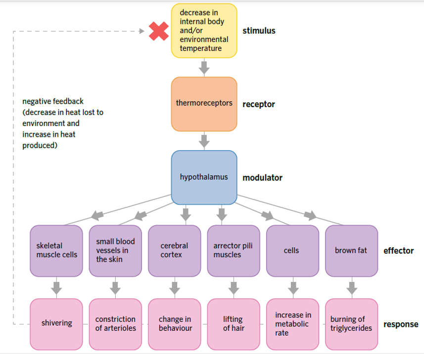
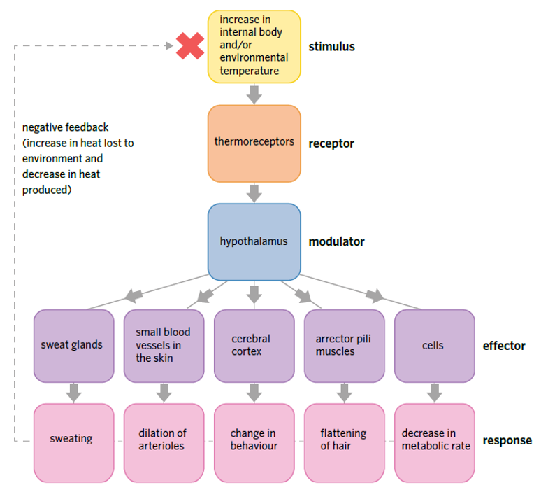

---
---
Heat transfer in the body

- Conduction (touching hot surface)
- Convection (transfer of hot liquid/gas)
- Evaporation (sweating)
- Radiation (electromagnetic waves e.g light/sun)

*Ectotherms* (cold blooded) maintain temperature by behavioural means **🦎**
*Endotherms* (warm blooded) maintain temperature by physiological means🐻

Physiological heat decrease

Physiological heat increase

