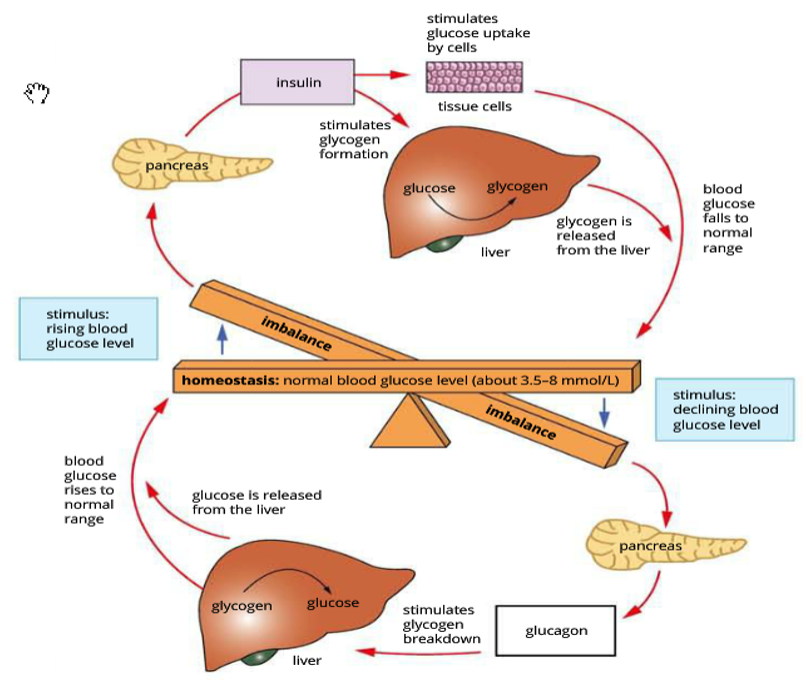

---
---
Hyperglycaemic- too high blood sugar
Hypoglycaemic- too low blood sugar
(opposite to turgidity)

*source: cambridge textbook*

Pancreas contains islets of Langerhans. They  are both the receptor and modulator

