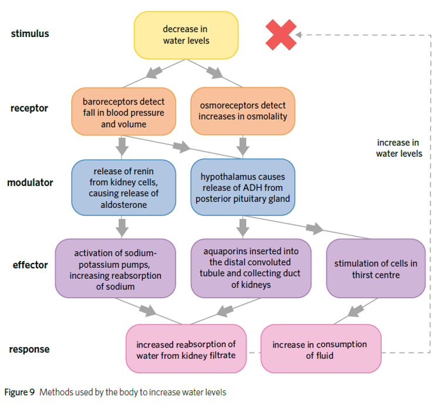
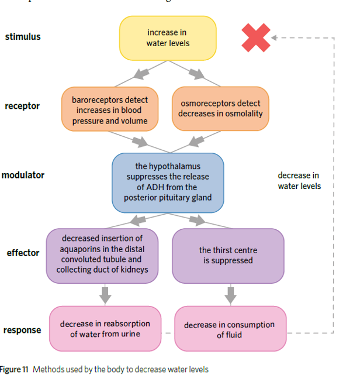
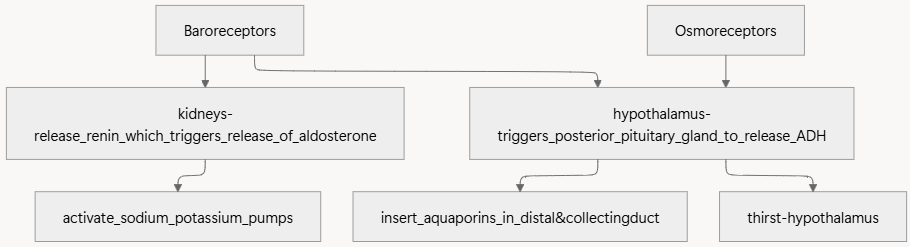

---
---
Extracellular- outside of cells

Intracellular- inside of the cell

Osmolality- the concentration of solute (in fluid)

Function of ADH

- changes the amount of water reabsorbed in nephron- inserts aquaporins (water channels) in the edge cells of the nephron tube
- goes to hypothalamus and triggers thirst

