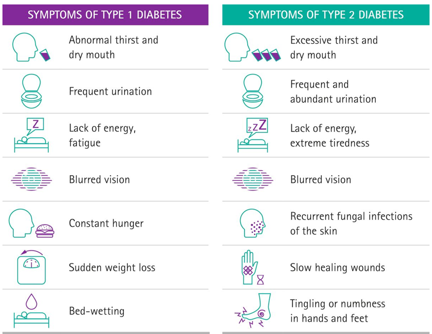

---
---
## Diabetes
type 1

- Immune system attacks beta cells
- A cells don’t die but stop working

type 2

- not enough insulin is produced, or
- body cells don’t respond to insulin
- Caused by lifestyle and genetic factors

*source: https://www.instagram.com/clinical_world/p/C0HBPJWMuxR/*

**Hyperglycaemia/hypoglycaemia**
- caused by type 1 diabetes
- hyperglycaemia- damages blood vessels
- hypoglycaemia- cells don’t have enough energy to function

Treatment of diabetes
- manually eating/injecting insulin into the body

## Hyperthyroidism

Normal functioning:

Diagnosal

- blood test

Cause

- graves’ disease

What happens

- Increased t3 and t4, reduced levels of tsh

Treatment

- beta-blockers and anti-thyroid drugs
- radioactive iodine to kill cells in thyroid
- remove/partly remove thyroid

---
other notes

CHolestrerol- glycoprotein (lipid protein)

- transport lipids through bloodstream
- high/low density forms (HDL
- high density (smaller molecule and doesn’t stick to artery)- lipids to muscles for energy
- low density- when too much fat/energy, fat goes to fat stores

Endocrine system:

glands, hormones, receptors

primary function: regulate bodily processes

don’e need to know the receptors- examples slide

need to know t3 and t4 but not the actual name

pituitary gland- master gland