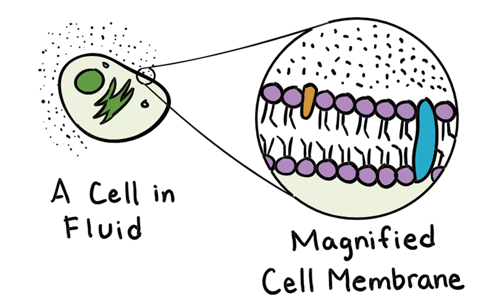

---
tags:
---

*image source: Khanacademy*

The line of purple things above that make up the cell membrane
### Phospholipid

Consists of:

- Head
    - Phosphate and glycerol
        - Polar/hydrophilic
- Tails
    - Fatty acids
        - Non-polar/hydrophobic
        - They can be saturated or unsaturated
            - saturated increases rigidity
            - unsaturated increases fluidity

### Transport across the phospholipid bilayer

It is **semipermeable**- only particular molecules can travel through it.

What determines whether a thing can go through:

- size- large molecules cannot pass through it
- polar/nonpolar
    - Polar/hydrophilic- dissolves in water
		
        
    - Nonpolar/hydrophobic- dissolves in lipids
        
        
- Charge- If it has a charge it cannot pass through (eg ions)

This is a form of **passive transport**- it does not require energy to pass through the membrane.