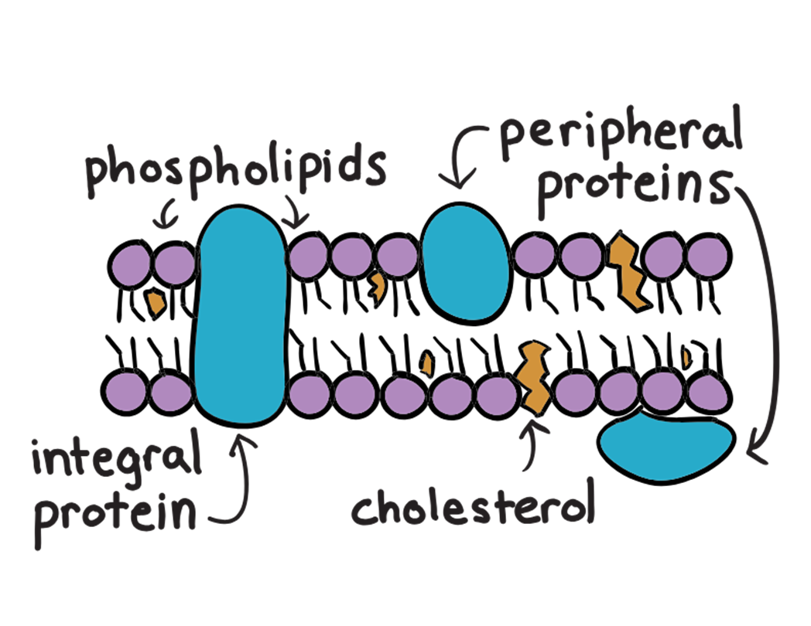

---
tags:
---

## Cholesterol

Lipid steroid

Distributed randomly

Holds phospholipids together and make sure they don’t separate too far (in higher temperatures) or press too close to each other (lower temperatures).

## Proteins

Proteins have various jobs:

- C- Catalyst: speed up chemical reactions with the help of enzymes
- C - Communication: receive signals or recognise cells and molecules

- A - Adhesion: stick to other cells, the extracellular mareix or the cytoskeleton
- T - Transport; channels or pumps that enables certain things to enter/exit the cell

There are 2 types of proteins, categorized by position on the membrane (see diagram above):

- integral/transmembrane
- peripheral