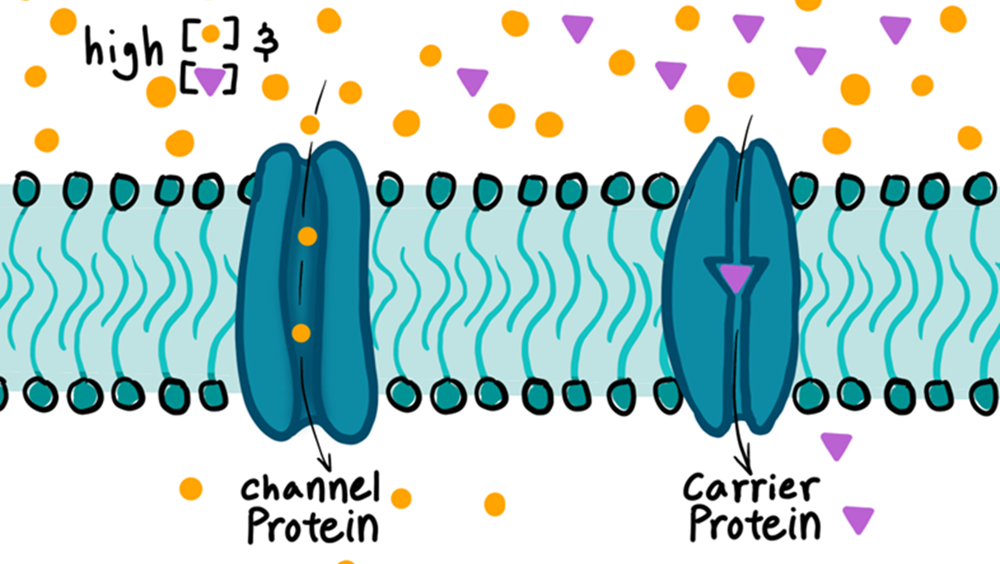

---
tags:
---
### Facilitated diffusion

There are a few proteins that help molecules cross the membrane. These allow larger and polar molecules to cross the membrane (they can’t cross normally)

**Channel proteins**
A form of passive transport, molecules freely flow through it in the direction of the concentration gradient. It works by opening and closing like a gate

Inside is hydrophilic, so mainly involved in the passage of water soluble particles such as ions

**Carrier proteins**
Can move the particles in both directions. It binds to each molecule to send them through. It can send it passively through in the direction of concentration gradient, and when an ATP is attached it can transport particles in the opposite direction (active transport).

Example: sodium potassium pump

The ions are pumped into and out of the axon with carrier proteins with ATP
