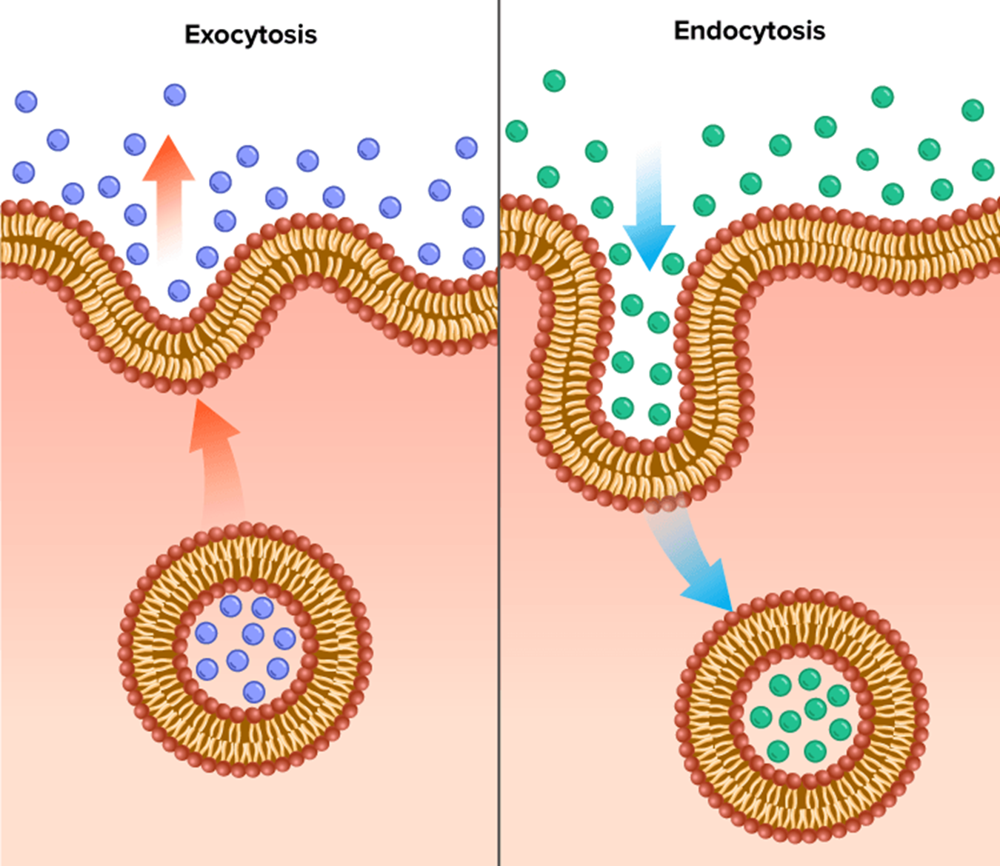

---
aliases:
---
Vesicles can help to transport larger molecules into and out of the cell.

It needs ATP so it is active transport

Endocytosis: transporting into the cell

- phagocytosis- solids
- pinocytosis- liquids

Exocytosis: transporting out of the cell

*source: https://flexbooks.ck12.org/cbook/ck-12-biology-flexbook-2.0/section/2.14/primary/lesson/active-transport-bio/*