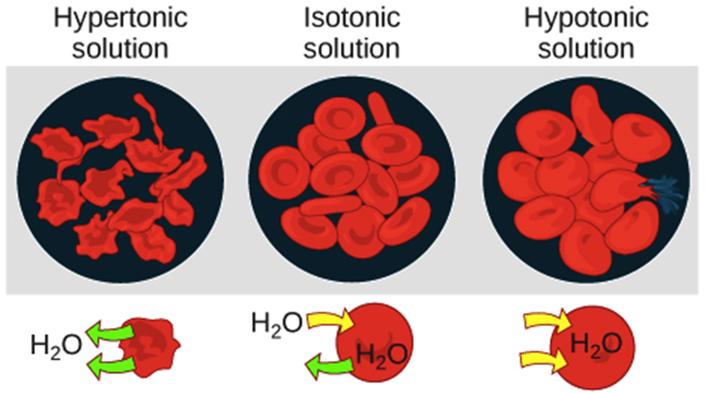
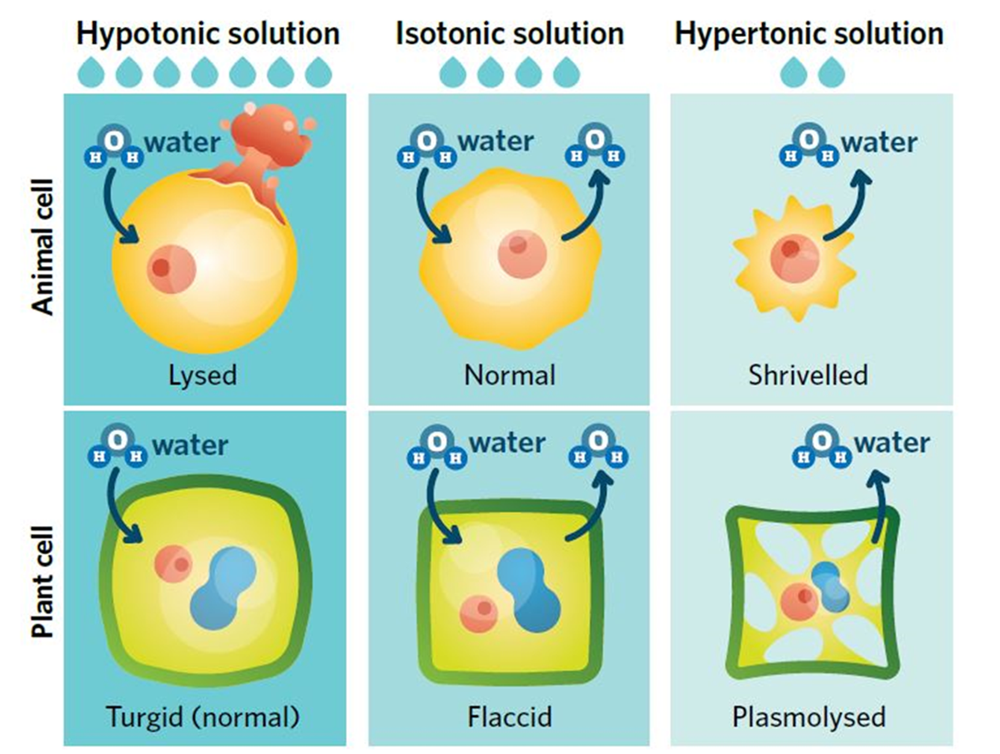

---
---
<aside>
🥔 The passive diffusion of solvent across a semipermeable membrane from a region of lower solute concentration to a region of higher solute concentration

</aside>
---
Example: Water will move across the cell membrane to the side that has the lowest concentration of water (more stuff inside the water)

The water molecules can fit through the membrane but the salt cannot.

Osmosis is a special case of diffusion because in osmosis only the solvent can move through the membrane, while in diffusion the solute can also move.

### Tonicity

Measure of the concentration of solutes

*source: https://en.wikipedia.org/wiki/File:Osmotic_pressure_on_blood_cells_diagram.svg*

Hypertonic: lack water

Isotonic: normal

Hypotonic: full of water

Lysed: bursted

Plasmolysed: when plant cells are weak and have sagging membranes