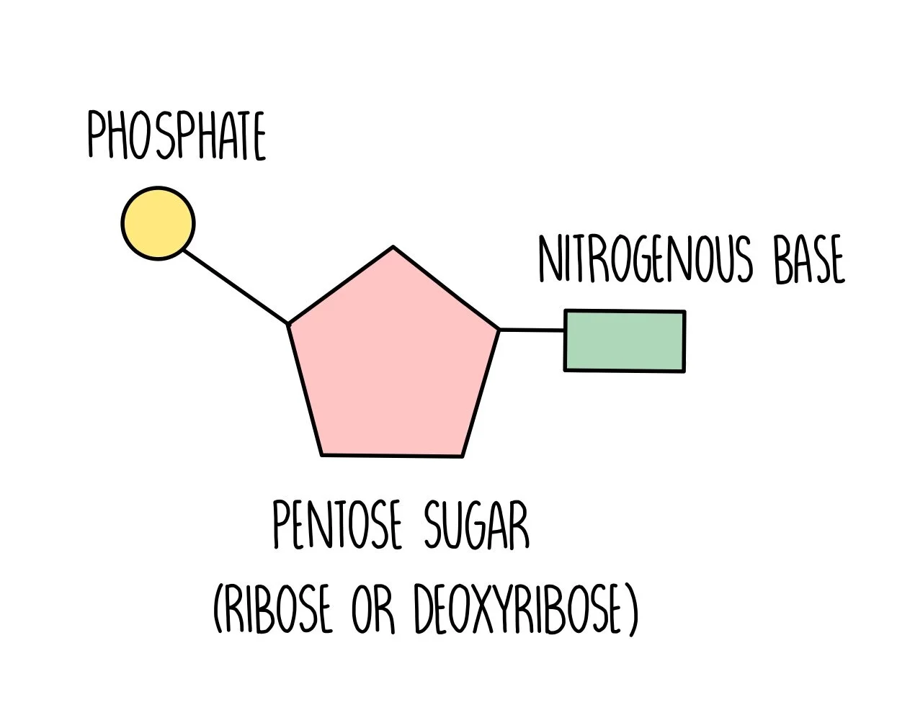
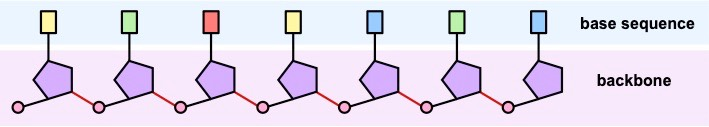

---
---

*source: https://www.thesciencehive.co.uk/nucleotides-and-nucleic-acids*
Need to know how to draw this ^^
the sugar is made of 5 carbons.

organic- contains carbon and hydrogen
CHONP- carbon, hydrogen, oxygen, nitrogen and phosphorous

don't use the term pentose sugar, use ribose/deoxyribose
ribose in rna, deoxyribose in dna

*source: Cornell, B. 2016. https://vce.bioninja.com.au/unit-three/area-of-study-1-genetics/nucleic-acids.html*

Nucleotides are connected together by **condensation polymerisation** (a covalent bond) to form long single-strand molecules (nucleic acid = polymer)

- Phosphate group attaches to the sugar of different nucleotide at the **3’–C position** via a **phosphodiester bond**
-  need to name this process and the bond

spiral shape because it the most stable energy configuration for the atoms
Strands are running in opposite directions so that they can face each other (**antiparallel**)

figure 3 ^^

*source: Cornell, B. 2016. https://vce.bioninja.com.au/unit-three/area-of-study-1-genetics/nucleic-acids.html*

**5' end** (refer to location of 5' on figure 3)
the end with the phosphate group sticking out
**<mark>(upstream for coding strand)</mark>**
(promoter is here)
note- ' = "prime"

Joined by hydrogen bonding

C-G: 3 hydrogen bonds

A-T/U: 2 hydrogen bonds
(cars are bigger than apples)

hydrogen bonds are weaker than the covalent bonds, disconnect when heated

---

remember:
- purines are double ringed
- pyrimidines are single ringed
- C,U,T has one hexagon "cut" off it

purines and pyrimidines connect to each other

Thymine and uracil are **almost chemically identical** and **perform the same function** in different molecules (T = DNA ; U = RNA)
