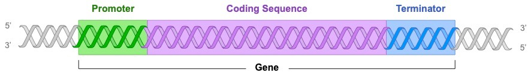

---
---
A sequence of DNA which is transcribed into RNA. Contains 3 parts:
- **Promoter:**  sequence that initiates transcription – binding site for the transcribing enzyme _(RNA polymerase)_
- **Coding Sequence:**  the sequence that is actually transcribed into RNA (may contain non-coding introns in eukaryotes)
- **Terminator:**  sequence that terminates transcription (mechanism of termination differs in prokaryotes and eukaryotes)
  
Genes can be located on either of the two strands of DNA, allowing for compact organisation of a cell’s genetic instructions

*source: Cornell, B. 2016. https://vce.bioninja.com.au/unit-three/area-of-study-1-genetics/gene-expression.html*

## Genetic code
The instructions within an mRNA sequence (in a gene) that tell a cell how to make a specific protein.
- Codons- triplets of bases which encode particular amino acid
- 4 nitrogenous bases- 64 different codon combinations (4^3 = 64)
- The order of the codons will determine the amino acid sequence for a polypeptide chain 
- Translation begins with a START codon (AUG) and terminates with a STOP codon (because there are no tRNA for stop)

Genetic code is:
- **Universal** - every living organism uses the same code
- **Degenerate** - there are only 20 amino acids but 64 codons, so more than one codon may code for the same amino acid
	- make sure you say dna **code** is degenerate, not dna is degenerate
- **Triplet**

the codons are for **mRNA** (not tRNA (anticodons))
always given chart in tests if question about it. (but won't say which is start and stop)

Need to remember:
STOP
you are away
u are going
you go away

