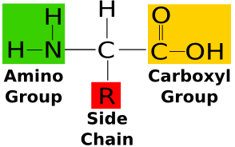

---
---

*source: https://www.google.com/url?sa=i&url=https%3A%2F%2Fbiochemden.com%2Fwhat-is-amino-acids%2F&psig=AOvVaw0-VzsGWSCIchedUY5CwVxL&ust=1768023904963000&source=images&cd=vfe&opi=89978449&ved=0CBUQjhxqFwoTCLCQ3vLg_ZEDFQAAAAAdAAAAABAK*

amine is also called *amino* group
Variable group- determines how the protein will fold and function (the chain folds and sticks to corresponding variables)
(also called R group)

R groups provide different properties:
Polar/nonpolar
Acidic/basic
Charged/uncharged
hydrophobic/hydrophilic
