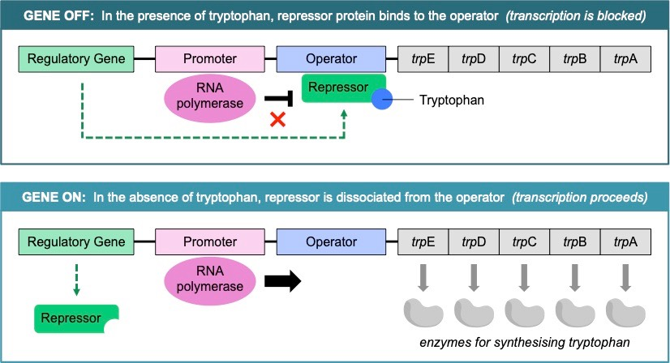

---
---
**Transcription factors** (a protein)
Mediate/impede RNA polymerase binding to the promoter of a gene (and hence alter transcription rates of the gene)
- Repressors- impedes -> decreases transcription by binding to the operator and blocking the rna polymerase. When things(eg tryptophan) attaches to them they reshape to be/not be able to **bind**
- Activators-  bind to the promoter-> promotes binding of rna polymerase

‎(whereas in eukaryotes: transcription factors bind to more distant regions (silencer or enhancer sites) to regulate levels of overall transcription)

The impact of transcription factors can be controlled by cell signals (eg hormones) which are triggered by internal/external cues
- E.g. Humans may produce different levels of melanin (skin pigment) according to their overall level of sun exposure (i.e. sun tanning)

*source: Cornell, B. 2016. https://vce.bioninja.com.au/unit-three/area-of-study-1-genetics/gene-regulation.html*

note- repressor stops it from even binding to promoter, not this
*also: 2 trp need to bind to repressor (don't need to know)*
no operator in eukaryotic genes