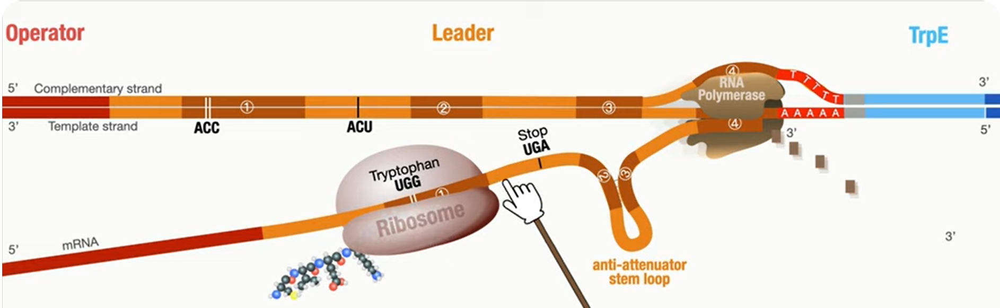

---
---
**The** **_trp_ Operon** (gene regulation in prokaryotic cell example)
- Operon- group of structural genes that share a promoter (next to each other, not like eukaryotes with alternative splicing)
	- this means they are all transcribed together (or none transcribed)
- <mark>promoter->operator->leader->structural genes</mark> (the operon)
- each structural gene has exons inside (but no introns)

The _trp_ operon codes for a bunch of enzymes that help promote make tryptophan (a non-essential amino acid)
- Its expression is controlled by a transcription factor called the _trp repressor_

---
**Attenuation**
Another method to reduce expression of the trp synthesizing enzymes in prokaryotic cells.
- Relies on the capacity for prokaryotes to undertake transcription and translation _at the same time_ (as the DNA is cytosolic)
- The trp repressor system blocks the _initiation_ of transcription, but attenuation prevents the _completion_ of transcription

In the leader sequence there is:
- tryptophan codon x2 -> stop codon -> attenuator stem loop -> antiattenuator stem loop -> attenuator
- Stem loops are caused by having self complementary sections in the sequence so it can fold and stick together
- The attenuator is a bunch of a's and t's (these only have 2 hydrogen bonds meaning this area is more susceptible to being detached)

---
The presence of tryptophan determines whether the attenuator or anti-terminator is formed within the leader sequence
- In prokaryotes, there is no nucleus meaning the translation happens at the same time as the transcription (the ribosome follows right behind the rna polymerase)
- If tryptophan is in **low supply**, it will take longer for a tRNA to bring a tryptophan to the ribosome. The ribosome waits there until it gets tryptophan, which allows time for the ~~_anti-attenuator_~~ to form on the mRNA transcript. The folding tries to pull the rna away, but fails because of the strength of the hydrogen bonds (note that one half of the antiattenuator is required for the attenuator stem loop meaning only one can form). Transcription continues.
- If tryptophan is in **high supply**, the ribosome will not need to pause at the two Trp codons within the leader sequence, which prevents the antiattenuator from forming. It continues to the stop codon, where the ribosome will cover a bit of the sequence that will form the antiattenuator to stop it from forming.
- The other half of the attenuator stem loop will be created and the attenuator stem loop will form. At this point in time the rna polymerase is at the attenuator section. Because it is loose here the folding will cause the RNA to be pulled away and disconnect from the rna polymerase which stops transcription

terminating hairpin loop ^^

non terminating hairpin loop^^

tryptophan- Trp E, D, C, B, A --> downstream
(the enzymes that make tryptophan)
note: these break down once there is enough trp

**vcaa need to know**
- ribosome doesn't pause at two trp codons in the leader region
- creating a terminator hairpin loop
- ribosome detaches from the short (attenuated) mRNA transcript strand and transcription stops
  -The five structural genes are not expressed (a shorter molecule is made)
Low tryptoppham
-ribosome pauses at the two adjacent trp codons in the leader region
waits for 2 tryptophan to 
the stalled ribosome causes a non terminating hairpin loop to form
five structural genes are expressed(transcription does not stop)

*source: https://www.youtube.com/watch?v=v7L9aCVPEcs (useful to watch if still confused)*