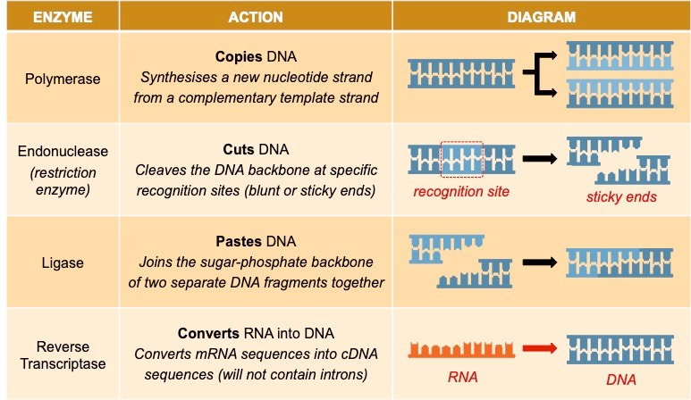

---
---
**Key Knowledge:**  
- Use of the 4 enzymes in manipulating DNA

- **Enzymes:** Polymerase (copy DNA), endonuclease (cuts DNA), ligase (paste/joins DNA)

**Enzymes**
Class of proteins that catalyse chemical reactions (enabling them to proceed under favourable conditions)

*source: Cornell, B. 2016. https://vce.bioninja.com.au/unit-three/area-of-study-1-biotechnolo/core-technologies.html*

Extra definitions (combine)
Polymerase
synthesise new complementary strand of DNA during  by joining free floating nucleotides in a 5' to 3' direction  

Endonuclease
cut the **double stranded** DNA of the target gene/plasmid

Ligase
catalyses joining by covalent phosphodiester bonds
- ligase connects the phosphodiester bonds but the sticky ends auto join the hydrogen bonds

Reverse transcriptase
uses mRNA transcript to synthesise complementary strand of cDNA with thymine replacing uracil

---

Sticky ends
- *overhanging base pairs* (must say this)

EcoRI (endonuclease example)
Eco = e coli
R = strain
I  =1 in roman numerals (1 because it was the 1st e coli restriction enzyme to be discovered)