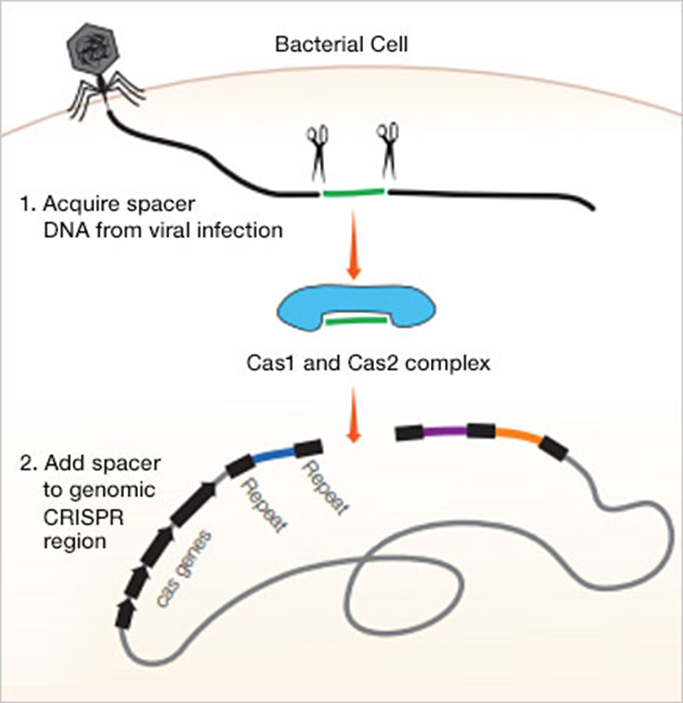
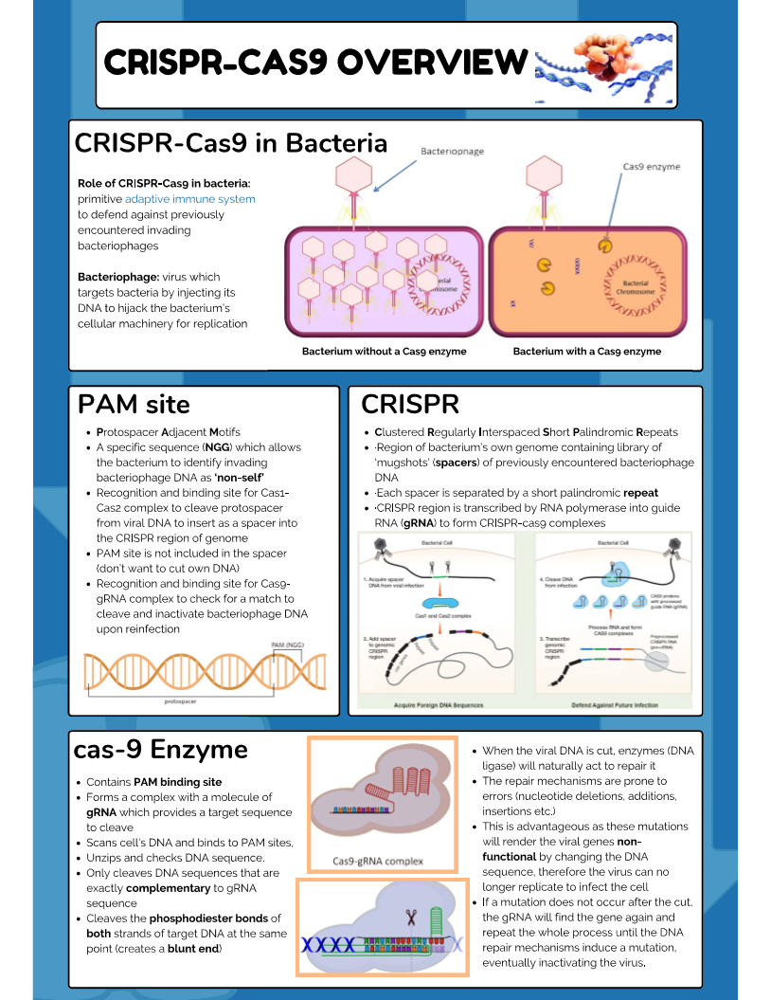
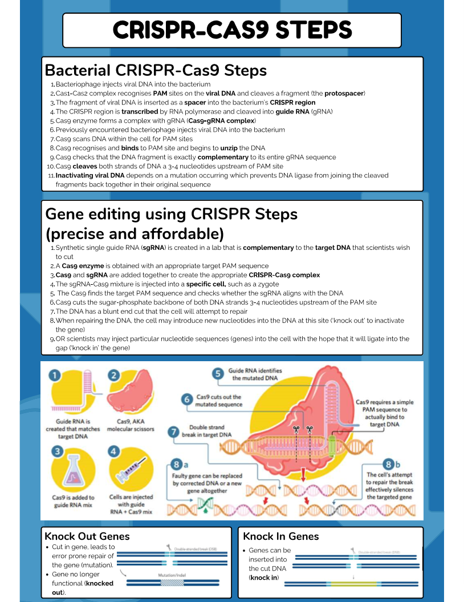

---
---
The CRISPR-Cas9 system
- natural function in bacteria, provides viral immunity
- CRISPR = ‘**c**lustered **r**egularly **i**nterspaced **s**hort **p**alindromic **r**epeats
- CRISPR locus- a region of bacterial genome that contains all DNA associated with the CRISPR adaptive immune system, including CAS genes, and the CRISPR array
	- CRISPR array - palindromic sequences of interspaced spacers and repeats within the bacterial genome that act as a memory bank for viral infections

Crispr is a specialised sequence of DNA that contains
- repeats
	- in between every spacer, when transcribed becomes tracer RNA
- spacers
	- segments of DNA cut from invading viruses

crispr contains:
- cas9 endonuclease
	- binds to a guide RNA to form a CRISPR Cas9 complex and cleaves both strands of DNA at the complementary sequence to the gRNA  
- guide RNA (for bacteria)
	- an RNA transcript composed of CRISPR RNA (derived from spacer sequences)
- synthetic single guide RNA (sgRNA) (for humans, gene editing)
	- a synthetically derived guide rna.
	- complementary to the sequence of the DNA that you want to cut.  

THe guide rna is made up of:
- tracr RNA
	- sticks the spacer/repeat rna to the cas9
- crispr RNA (spacer + repeat rna)
	- taken from the crispr array, one spacer and one repeat. The repeat sticks to the tracrRNA

**Tracer RNA**
an RNA sequence formed somewhere else in the cell (not the crispr array) that is base paired to the repeats and allows it to bind to the cas9 enzyme
- guides crispr-cas9 complex to cut the complementary DNA sequence  

**protospacer adjacent motif** (PAM) sequence
a short nucleotide sequence just downstream (on the coding strand) from the target spacer
- allow bacterium to identify invading bacteriophage DNA as foreign
- is the recognition and binding site for CAS9 + gRNA complex to check for a match to cleave
- **why does crispr cas9 not cut itself** (question)
	- sequence is **upstream** of a PAM
	- spacers separated by repeats have no PAM
- say that ngg is the MOST COMMON pam sequence rather than the only sequence

How does crispr differ from restriction endonucleases?
- restriction endonucleases have fixed recognition site
- they can both defend against bacteria

Vcaa question structure- what to know

- note the protospacer is cut from in the 5' end (upstream) of the pam site on the coding strand
	- crispr moves upstream of the pam but then checks the opposite strand
	- cuts both strands 3-5 bases upstream of the pam

- the spacer is put into the 5' end of the coding strand of the DNA
---
## Class summary sheet

