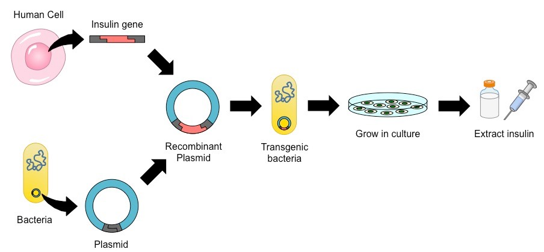

---
---
**Key Knowledge:**  
- The use of recombinant plasmids as vectors to transform bacterial cells as demonstrated by the production of human insulin

**Gene cloning** is the process of isolating and copying a gene of interest in order to facilitate its expression within a host organism

**Example: mass production of human insulin using bacteria for diabetes treatment**

Reverse transcriptase is used to create a cDNA copy of the human insuling gene without any intron sequences

Bacteria can divide and reproduce rapidly
-cultivated in fermentation tank
-purified and packaged to treat individuals with type 2 diabetes mellitus

**Overview**

*source: Cornell, B. 2016. https://vce.bioninja.com.au/unit-three/area-of-study-1-biotechnolo/gene-cloning.html*