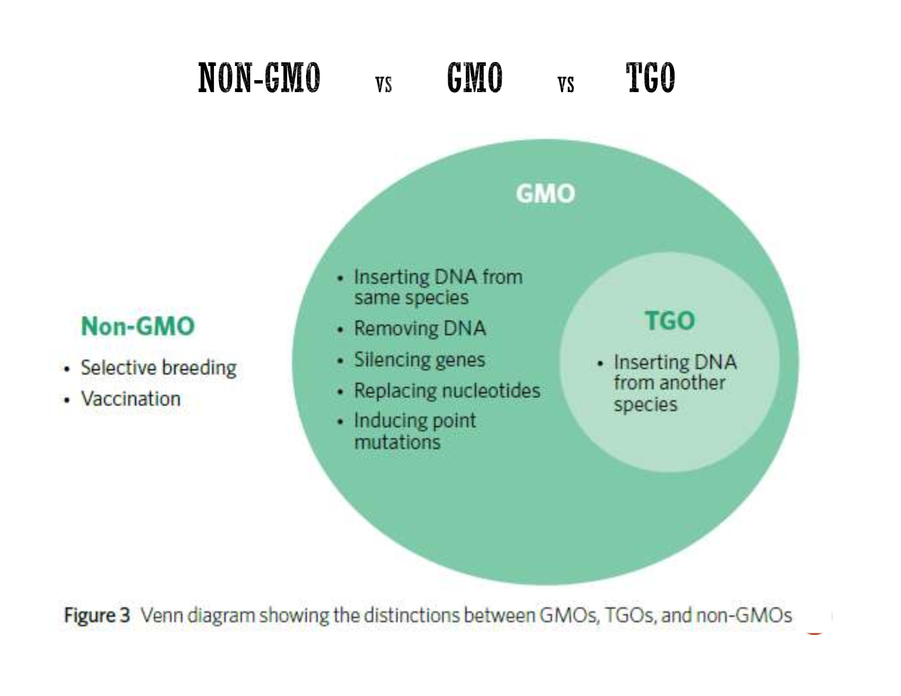
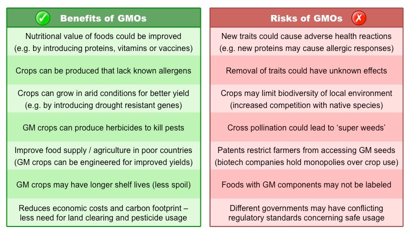

---
---
**Key Knowledge:**  
- Use of genetically modified and transgenic organisms in agriculture

***Overview***
there are other reasons to do genetic modifications but agriculture is what you need to know about
- pest resistance, disease resistance, herbicide resistance, increase yield.
focus on ethical implications, not social and biological (see powerpoint)

**Important don't know hard stuff**
the table below (benefits/risks of gmos)

---
**Genetic modification**
- alteration of a genome using artificial genetic engineering technologies
- Typically achieved by the addition or silencing of a specific gene (characteristic)
- To be identified as a genetically modified organism (GMO), the change should be heritable (able to be passed on)  

**Transgenics**
- a type of genetic modification where DNA is introduced from an _unrelated species_

**gmo use examples on crops:** (eg with crispr cas9)
- better for environment (when in manure)
- disease resistance
- yield
	- Plant absorption spectra have been modified to increase photosynthetic efficiencies (e.g. new pigments introduced)
	- Improvements in photorespiration efficiencies has resulted in increased food production in a variety of common C3 plants

*source: Cornell, B. 2016. https://vce.bioninja.com.au/unit-three/area-of-study-1-biotechnolo/genetic-modification.html*

gmo in checklist- just the difference between gm/tgo and stuff like that (not much to learn)
- gmo- dna artificially changed
- transgenic- dna from a different species **inserted**  <mark>(artificial doesn't count, even if the scientists edited it to make it look like another species' genome)</mark>