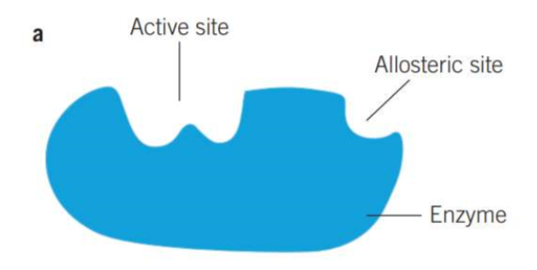

---
---
Enzymes
- Enzymes- biological catalysts that **increase the rate of reaction** by **lowering the activation energy** without (the enzyme) being used up
- Enzymes allow reactions to occur more frequently and faster at a rate which can sustain life, otherwise reactions would be too slow

say biological catalyst instead of enzyme if question asks to define [enzyme name] and already says it is an enzyme

Structure
- Consist of 1+ polypeptide chains
- Have a SPECIFIC SHAPE (need to say this) (based on tertiary and quaternary folding)
- Enzymes are proteins that have a specific structure/shape based on the interactions between amino acids which form H bonds, disulfide bridges and other interactions to form secondary, tertiary and quaternary structures

Active site:
- where the substrate binds
- complementary to the substrate's shape, has HIGH AFFINITY (high attraction) for the substrate
- when substrate binds, activation energy is lowered and reaction is catalysed
- when connected, an **enzyme-substrate** complex forms
Allosteric site
- a binding site on he enzyme where OTHER molecules that are not the substrate can bind

when drawing an enzyme must draw this:

and make sure the active site's shape is complementary to the thing when drawing