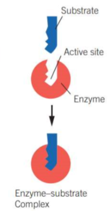
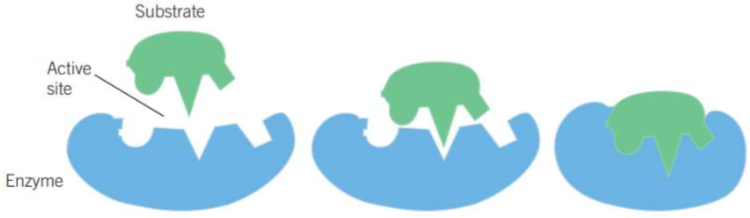

---
---
Enzyme models

|                   | Lock and Key                                                                                                                                           | Induced fit (the better model)                                                                                                                      |
| ----------------- | ------------------------------------------------------------------------------------------------------------------------------------------------------ | --------------------------------------------------------------------------------------------------------------------------------------------------- |
|                   | shape of the substrate is a perfect fit for the active site                                                                                            | active site is not a perfect fit for the substrate but upon binding to the substrate, the active site alters its shape to mold around the substrate |
| **Advantages**    | - shows the high level of specificity of enzymes                                                                                                       | - show how different enzymes can fit multiple substrates - shows their dynamic nature (they can change shape when bind)                          |
| **Disadvantages** | - does not consider that the enzyme is dynamic - does not explain how enzymes accomodate for multiple substances                                    | - does not account for other chemical factors that may be involved eg coenzymes and cofactors                                                       |
|                   |  |                                                                                                |
need to know what are models, how they work, advantages and disadvantages (study design)

