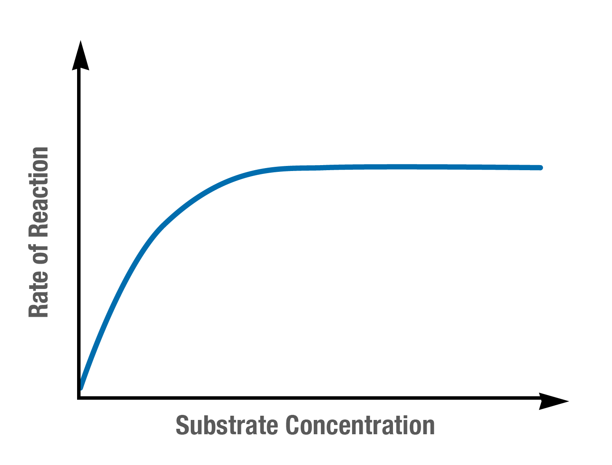

---
---
Temperature increase
- increase kinetic energy of molecules resulting in **more collisions between substrate and enzyme**
- irreversible as folding will not happen again after denaturation (loses 3D conformational structure)
- decrease is reversible

*note temperatures vary between enzymes*

**pH- acidity**
Affects enzyme function

At different pH levels, the chemical environment of an enzyme changes

This disrupts the bonds that cause the enzyme to fold causing denaturation both ABOVE and BELOW optimum pH of an enzyme.

(low pH = acidic eg pepsin)

**enzyme/substrate concentration**
- increased substrate/active sites available + increased collisions

saturation point
- active sites fully occupied (or surplus of unnecessary enzymes), increasing concentration further has no effect

*source: https://www.monash.edu/student-academic-success/biology/regulation-of-biochemical-pathways/factors-affecting-enzyme-activity*