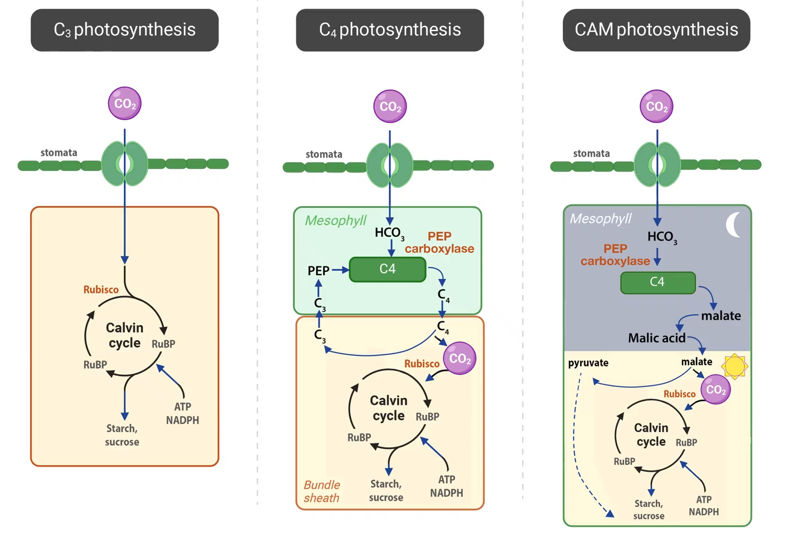
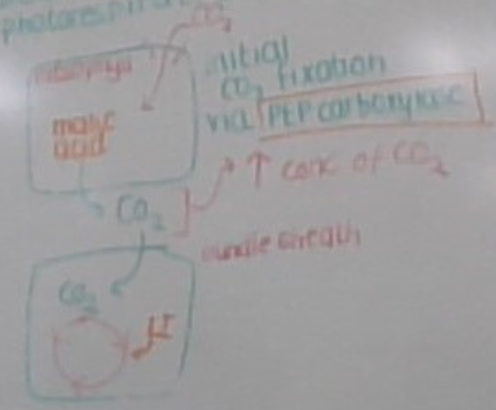

---
---
| c4 (because 4 carbon molecule)                                                                                                                                                                                                                                                                                                                                                                                                                                                    | cam                                                                                                                                                                                                                                                                                                                                                                                                                                                                    |
| --------------------------------------------------------------------------------------------------------------------------------------------------------------------------------------------------------------------------------------------------------------------------------------------------------------------------------------------------------------------------------------------------------------------------------------------------------------------------------- | ---------------------------------------------------------------------------------------------------------------------------------------------------------------------------------------------------------------------------------------------------------------------------------------------------------------------------------------------------------------------------------------------------------------------------------------------------------------------- |
| c4 plants have an adaptation to minimize photorespiration by the **physical separation** of carbon fixation and calvin cycle. 1. co2 is converted into malate (a 4 carbon molecule) in the mesophyll cell and moved to the bundle sheath cells, where rubisco is. 2. --> rubisco always has a high availability/concentration of co2 (in the form of malate) for the light independent stage to occur the o2 from the split h2O does not go to the bundle sheath   | cam plants have an adaptation to minimize photorespiration by the **time** separation of carbon fixation and calvin cycle. 1. Night: stomatas open, co2 converted into malate (4 carbon molecule) in the mesophyll cell and moved into **vacuoles** 2. --> malate convert to co2, released around rubisco during the daytime to maintain high co2 concentration when light independent reaction is taking place. stomata close during day to prevent water loss. |
| hot and tropical (more humid)                                                                                                                                                                                                                                                                                                                                                                                                                                                     | hot and dry (low humidity) (eg deserts, cactus)                                                                                                                                                                                                                                                                                                                                                                                                                        |
c3 (the default one) is cool, wet environment (only one where colder temp better than hot)
key words- c4, physical separation, malate

Carbon fixation
- process of using the c from co2 into the calvin cycle
- catalyse incorporation/fixation of carbon in co2 into an organic molecule (happens twice - pep carboxylase (convert co2 to malate)(c4 and cam), then rubisco (using co2 (broken down malate)))

*source: https://www.monash.edu/student-academic-success/biology/photosynthesis/photosynthesis-in-c3,-c4-and-cam-plants*

c3 and c4 open stomata during the day because they don't have the ability to hold co2 until the day if done at night (cam stomatas open at night to reduce water loss)

Although the light-independent stage differs between C3, C4 and CAM plants, the light-independent stage is the same.
- c3, c4 and cam all do LD stage in mesophyll
- also describe glycolysis + other relevant steps- refer to study design

another C4 diagram
