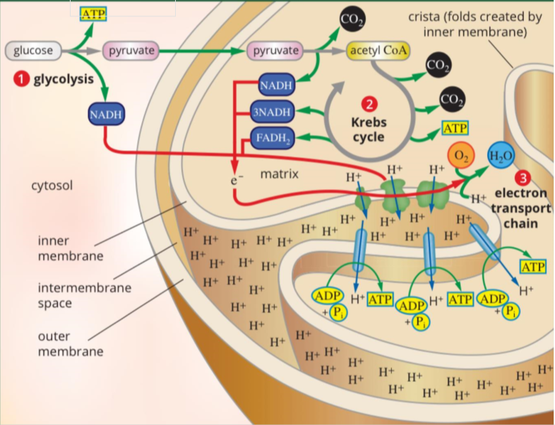

---
---
1. **glycolysis** (occurs in the cytosol)
- anaerobic
1 glucose breaks down --> 2 pyruvate

| inputs           | outputs           |
| ---------------- | ----------------- |
| 1 glucose        | 2 pyruvaet        |
| 2 adp + 2 Pi     | 2 ATP (net yield) |
| 2 NAD+ (aka NAD) | 2 NADH            |
glycolysis video: https://www.youtube.com/watch?v=EfGlznwfu9U&t=43s (don't need to know everything here)

primary purpose of glycolysis is to produce limited ATP until oxygen becomes available, then secondary is pyruvate, not the other way round. (lost a mark for this)

---
2. **krebs cycle** aka citric acid cycle (occurs in the mitochondrial matrix)
- aerobic (need oxygen but the oxygen is not consumed)
- Link reaction- 2 pyruvates oxidised --> acetyl coenzyme A
- these acetyl coa enters the krebs cycle and is broken down (oxidised) into co2
- cycles twice (one per acetyl coa)

| Inputs                          | Outputs           |
| ------------------------------- | ----------------- |
| 2 pyruvate (2 acetyl coa- link) | co2 (released)    |
| 2adp +2pi                       | 2 atp (net yield) |
| 6 NAD+                          | 6 nadh            |
| 2 fadh                          | 2 fadh2           |
(note the table is for 2 cycles)
(just know this simple version rather than the circle)
link reaction is part of krebs cycle for vce

the co2 created in krebs cycle doesn't require oxygen as input, it is already from the glucose

If asked the purpose of a given step
- purpose of the inpus and outputs
- carrying energy in the form of hydrogen and electrons which will be useful in he electron transport chain
- produce a small amount of ATP

---
1. **Elecron transport chain (occurs in the cristae of the INNER mitochondrial membrane (the villi shaped things))** (don't say matrix or intermembrane)

- NADH and FADH2 unload H+ ions and electrons
- electrons power active transport of hydrogens  to intermembrane space (electrochemical/proton gradient)
- h+ ions move through ATP synthase
- as they move through, kinetic energy makes atp
- free h and o molecules and electrons combine to produce water (excreted or sent to photosynthesis)
- electrons from the unloaded carrier molecules are drawn down the chain by no2 molecule at the bottom and 26 or 28 atp at the en[unfinished check powerpoint]

Inner mitochondrial membrane
- separates mitochondria from cellular environment
	- selective barrier in terms of co2 and atp

| Inputs                   | Outputs      |
| ------------------------ | ------------ |
| NADH                     | NAD+         |
| FADH2                    | FAD+         |
| 26 or 28 adp +26 or 28pi | 26 or 28 atp |
| oxygen                   | water        |

fadh before
becomes fadh2
fad+ after

cytochrome- the "taxis" that bring the electrons to different proteins in the membrane in the electron transport chain

don't need to know oxidative phosphoryylation name
(the name of the process of the electron transport chain (plus chemiosmosis))

If question is about a single celled organism must talk about the entire organism rather than "a cell", especially if it is about eg what happens if ETC stops

*source: https://www.youtube.com/watch?v=zJNx1DDqIVo*

very unlikely to be asked about the actual steps
what is the name of the location of the 3 steps
1. hydrogen form concentration gradient
2. hydrogen ions move through produce atp
3. hydrongens combine with the elctrons and oxygens to produce water

ETC visualisation: https://www.youtube.com/watch?v=LQmTKxI4Wn4
ETC digital model: [Electron transport chain](https://mw.concord.org/modeler/showcase/biology/etc.html)

how is hydrogen and electrons used in the electron transport chain?
- both combine with oxygen to form h20

For each step, always state the products produced if possible in a question

*note: also need to learn parts of the mitochondria. just use the diagram above
Other parts to know not in diagram:*
- the ribosomes, dna, proteins in wall
- these but for chloroplasts, also starch granules
###### Mitochondria
The powerhouse of the cell (will lose marks if give this as an answer)
it is a mini cell in the cell that adapted to assist and depend on parent cell

