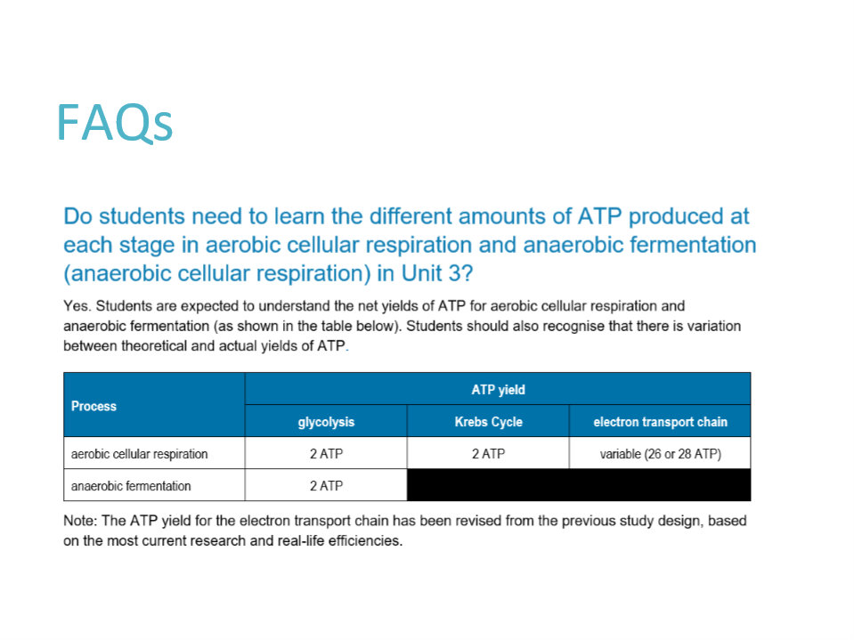

---
---
use the term anaerobic FERMENTATION instead of anaerobic respiration

- the version of cellular respiration you do when you lacking oxygen eg when running
-  involves reactions in the **cytosol** only
‎
- net yield- 2 atp per glucose
- NADH converted to NAD+

| some bacteria and mammal muscle                      | plants/yeast/some bacteria                                    |
| ---------------------------------------------------- | ------------------------------------------------------------- |
| 2 pyruvate + NADH --> 2 lactic acid, 2NAD+ (no co2!) | 2 pyruvate + NADH -->2 ethanol + 2 co2 (co2 released) + 2NAD+ |
- *lactic acid can be converted back to pyruvate ~~(lactic acid fermentation)~~ Note this does not produce ATP
- *ethanol* cannot but can still be *directly used for cellresp*
- *ethanol buildup* could cause *harmful pH* level for cell

*source: vcaa*