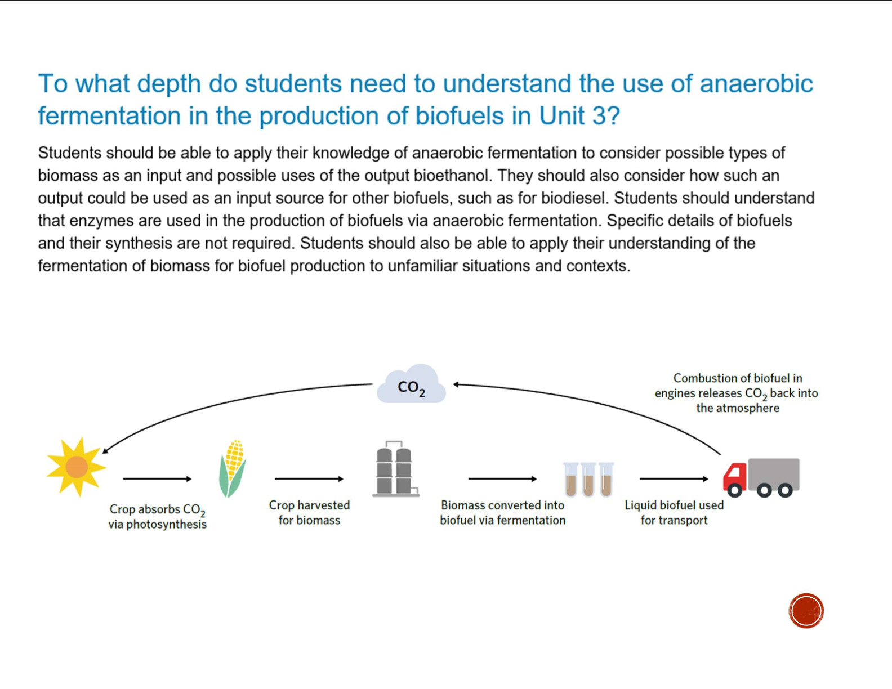

---
---
- uses and applications of anaerobic fermentation of biomass for biofuel production

(this page will never be finished)

Biofuels
- made from organic material (biomass)
	- biomass: plant/animal material that can be sourced from many of our existing industries (eg agriculture/forestry)
	- renewable alternative to fossil fuels
	- why renewable?
		- can be sourced from action of other industries eg leftovers from farming
		- largely carbon neutral- the co2 released during combustion is reabsorbed into the next plant
		- there was a table on this slide, write it here

How are biofuels made (epi is mini version of this)
- anaerobic fermentation
	- ethanol harnessed and refined into [unf]
- steps
	1. Deconstruction
		- biomass is treated to increase its surface area- increases rate of fermentation (break down cell wall and cellulose)
		- uses methods such as [unf]
	2. Digestion by enzymes
		- Biomass the exposed to enzymes
		- break down startch and celulose and convert them into glucose and other sugard
		- [unf]
	3. Ethanol fermentation
		- Yeast facilitates anaerobic fermentation of the sugars producedd in 2, creating ethanol
	4. Purification and dehydration
		- [unf]
2 types of biofuels
- Bioethanol
- Biodiesel
	- produced via formulation of fatty acids from natural oils like animal fats and vegetable oil
Uses and applications
- can be blended w/ gasoline to cut down on carbon monoxide and other smog-causing emissions. Foe example, the fuel E10 (10% ethanol and 90$ gasolint)
- can be stored and used for [unf]
Implications- be a little bit familiar, some will be good for epi introduction (reason why you've selected your biomass)

| Strengths    | Weaknesses |
| ------------ | ---------- |
| [unfinished] |            |
gen 1- crops and food
gen 2 - leftover scraps/waste material
some people chose to look at 1st vs second generation for epi

**Why is first generation biomass more efficient** (vcaa question)
- Both contain energy stored in the molecular bonds (1). First generation biomass is  usually a food source and the energy is more accessible (1) whereas second generation biomass has energy stored in longer carbon chains (1).

*source: vcaa*