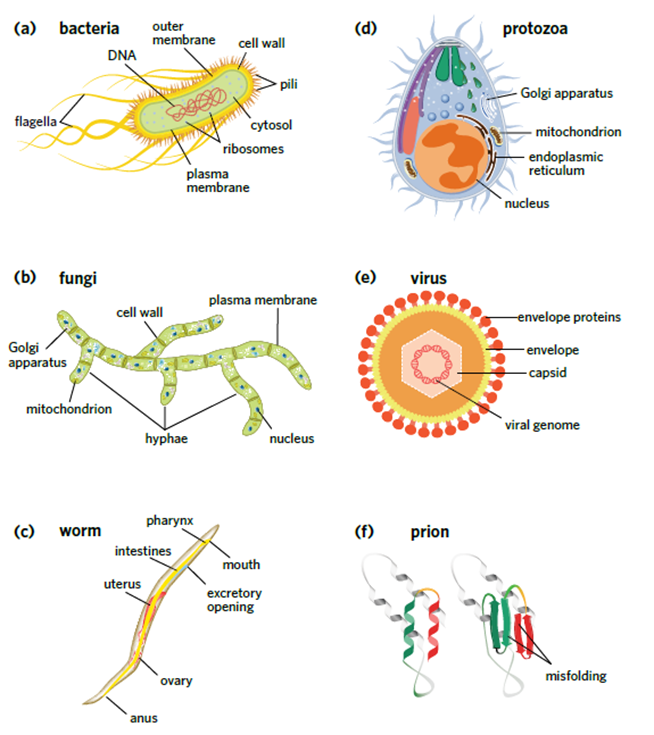

---
---
Pathogen
- **Causative agent of disease**

### Cellular
- has cellular structure
- exhibits the processes of living things
- can reproduce independently

#### Bacteria
- unicellular
- prokaryotes

produces toxins which can:
- inhibit protein synthesis
- Damage cell membranes or disrupt the transport of substances across membranes
- Interfere with nerve function

exotoxins — secreted toxins

endotoxins — parts of the outer membrane that are released when bacteria die.

Either the bacterial cell or toxins produced by bacteria can be recognised by immune cells as a foreign antigen

Treated with **antibiotics.**

Bacteria reproduction (simple understanding needed only)
- binary fission
- dna duplicates, membrane divides
- faster when conditions are favourable (pH, temp, nutrients, water etc)

Ways in which bacterial cells can demonstrate resistance to antibiotics
bacteria can:
- have reduced permeability  
- have altered binding sites that antibiotics can no longer bind to as they are not specific matches  
- Have increased ability to expel antibiotics  
- Produce enzymes that inactivate or chemically modify antibiotics

#### fungi

- **Multicellular, eukaryotic** and include moulds, yeasts and fleshy fungi.

- secrete digestive enzymes to break down organic matter and absorb the products, also causing infection
- generally long lasting because fungi grow slow
- •Killed with fungicides

#### Parasites

- organism that **lives in or on another organism**, usually deriving nutrition from the host organism

- **Endoparasite**: lives inside the host (eg tapeworms)
- **Ectoparasite**: lives on it’s host (eg/ the surface) (eg hair lice)

#### Protozoa

- **single celled, eukaryotic** organisms that belong to the protist kingdom

•Under certain adverse conditions, some protozoans produce a **protective capsule called a cyst.** 

•A cyst also allows it to **survive outside a host** until it is able to reinfect.

•eg Malaria

### Non-Cellular
- no cellular structure
- does not exhibits the processes of living things
- requires host cell to reproduce

#### Virus

- an infectious agent (non-cellular) composed of genetic material (DNA or RNA) inside a protein coat (capsid)

- Bacteriophage is a virus that only infects bacterial cells.

- Viruses cause disease through the lysis of cells during viral replication

Viruses may be detected by immune cells as:
- Free-floating virions (single virus particle)
- Once they have infected a cell, the virally infected cell may display foreign viral antigens on it’s MHC I.

#### Prions
- abnormally folded proteins that have the ability to induce normal proteins nearby to become misfolded.
- Causes spongiform encephalopathy, which is characterised by the degeneration of the brain and can be transmitted between individuals

Awards:
- The only infectious agent that does NOT contain nucleic acids
- Smallest pathogen

