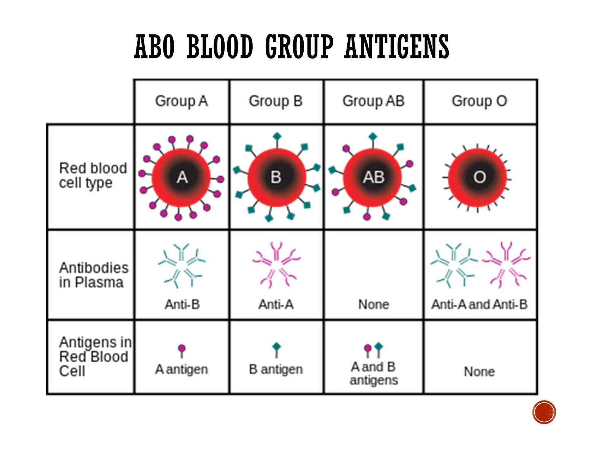

---
---
**Complement proteins**
LAC
•Lysis: puncture membranes by forming **membrane attack complexes**
•Attract: attract **phagocyte**s to site of infection (chemotaxis).
•Coats: stick to pathogens helping **phagocytes** identify them (opsonisation) and reduce pathogen's mobility

**Cytokines**
•Coordinate the immune response and allows one cell to communicate with another.
•#Cytokines are involved in a variety of roles including proliferation of lymphocytes, inducing inflammation and fever, activating macrophages.

**Interferon**
A type of cytokine released by an infected host cell that defends against further viral infections
1. stimulates infected cells to undergo apoptosis
2. *triggers production of defensive proteins (also in surrounding cells) that inhibit translation- prevent viral protein synthesis & replication*
3. attracts **NK cells and macrophages** to assist in killing virus-infected **host cells**
4. Make the plasma membrane of surrounding cells less fluid, makes it harder for virus to fuse with it and infect it.

**Fever**
caused by release of cytokines which stimulate hypothalamus to raise set point of body temperature 
1. abnormally high body temp- slows pathogen replication
2. increase heart rate (faster blood flow (WBC's) to site)
3. speed up metabolic reactions (faster tissue repair)
4. increased T cell production
5. intensified interferon effect

---
Stuff to memorize:

Antigen:
molecules that assist in distinguishing a substance as non-self and may trigger/elicit an immune response

Self antigen
located on the surface of cells and mark cells of an organism as 'self' so that the immune system does not attack them. They are not foreign and therefore tolerated by the immune system.

Non-self antigens:
a molecule from outside the body that is recognized by the immune system and initiates an immune response

Don't need to memorise, just understand and can figure out ^^