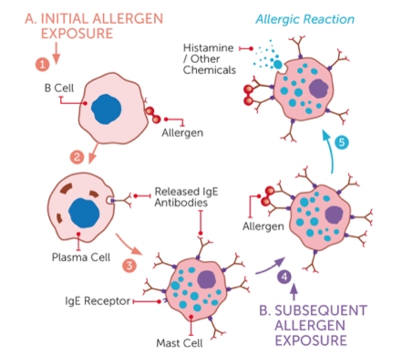
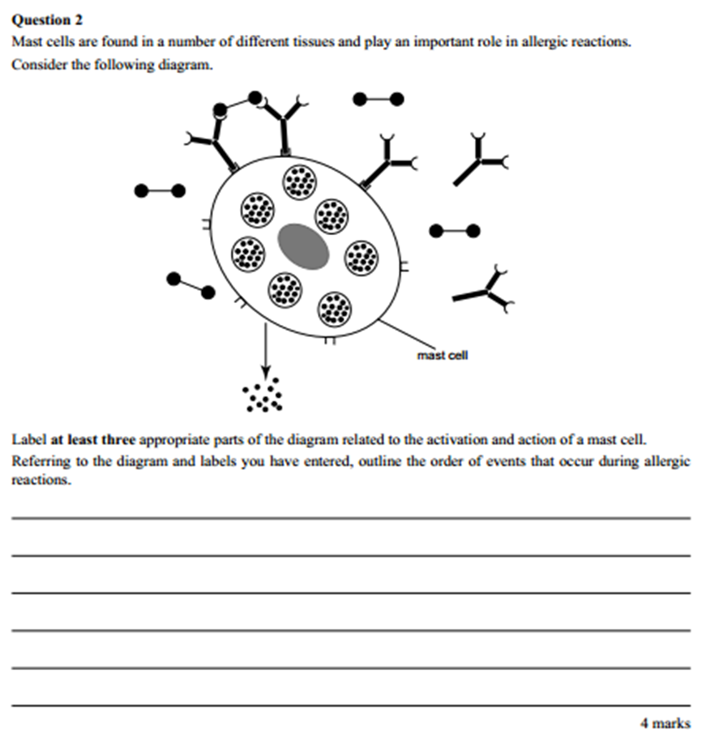

---
---
#### Allergens
Allergic reactions are a **malfunction** of the immune system 
![[../../assets/52596b134b823739f248d3f1cc15fa0b51d0394f6825c4183b31df511906457c3f74fdffbb22da26c6f8c8ec0a0d7a8d54c5e0ad6b4d9b589226cb24a33d7ee0.png]]
*source: vcaa*

1. Initial exposure to allergen: makes plasma cells produce IgE antibodies, which attach to complementary receptors on mast cells, priming them
2. Subsequent exposure: the allergens bind to the IgE antibodies on primed mast cells in a process called **cross-linking**.
3. The mast cells release histamines (**degranulation**), triggering an inflammatory response leading to allergy symptoms. (such as inflammation/swelling, rash, sneezing, shortness of breath.) which can vary in severity.
mention "cross linking" - see diagram, triggering the response

*source: https://www.jognn.org/article/S0884-2175(15)35309-0/abstract*

**if someone is stung by a wasp for the second time and have a huge allergic response within minutes why?**
allergens from the wasp venom bind to IgE antibodies already bound to mast cells (which have been primed due to a prior exposure), causing degranulation of mast cells releasing histamines which initiate the inflammatory response and lead to allergic reactions