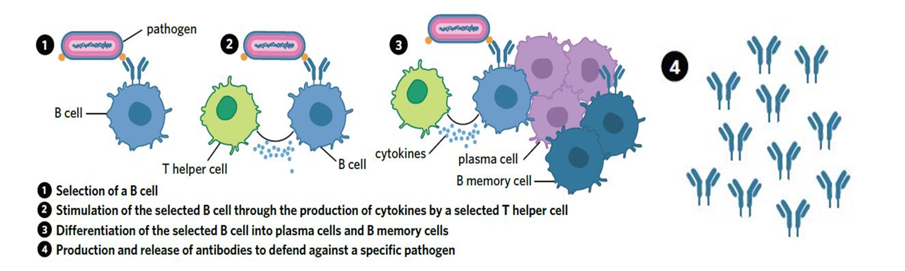

---
---
**Clonal selection + expansion**
1. complementary APC presents to helper t cell (which clonally expands)
2. naive b cell encounters and presents antigen (MHC II) in *extracellular fluid* (1 mark)
3. helper t cell binds to naive b cell with complementary MHC II (1) and releases cytokines to activate naive b cell (clonal selection)(1), causing clonal expansion.
###### Activated B cells
Plasma cell
- antibody factory (state antibody functions)

B Memory cell
- **==faster and larger==** immune response upon reinfection (stronger is not accepted)

## Humoral adaptive immunity summary

*unknown source*

**The human immune system can defend against pathogens such as E. coli. Describe how long-term immunity against a bacterial pathogen is achieved.**
5 marks
• APC engulfs pathogen and displays antigen on MHCII 
• APC travels to lymph node and presents antigen to Th cells, who help to activate B cells that have also encountered this antigen.  
• Clonal expansion of B cells into B plasma cells and B memory cells
• B plasma cells release specific antibodies to attach to antigens and neutralise and opsonise the bacteria.  
• Upon future infections and encounters with the same antigen B memory cells will  
rapidly multiply and differentiate into B plasma cells to remove the pathogen - long term immunity
(adapt to question eg replace pathogen with the actual one in question, also say virus/bacteria etc)

**Standard level of detail for a 3 marker**
c) Explain how the body would develop memory for these antigens.  

Humoral response:  
1. **APC** presents antigen on **MHC II**  
2. APC moves to **lymph node**  
3. **T helper cells** are activated 
4. **Naïve B Cell** encounters free floating virus in ==**extracellular fluid**==  
5. T helper activates naive B cell (**clonal selection**)
6. B cell undergoes **clonal expansion**- **Plasma B cells and Memory B cells.**  
7. (Plasma B cells produce **specific antigens to RSV**) This point not relevant for producing memory  
8. Memory B cells produce a **faster, larger and longer response** on subsequent infection.  

Note: This response is similar to what was accepted in the 2020 Exam but was worth 4 marks  
& 5 marks in 2021. (3 marks)

basically (shortened edition):
- detail antigen presentation
- B cell activation
- function of each of these (plasma and memory B cells).