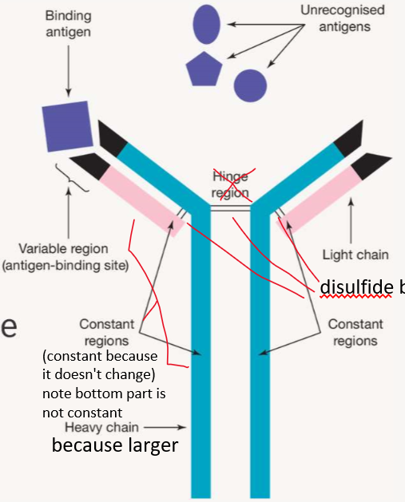
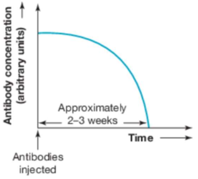

---
---
##### Antibodies
- binds to complementary [antigen] on pathogen

Neutralisation
- prevent binding of pathogen to self cells to neutralise harmful effects

Opsonisation
- Tag pathogens for destruction activating phagocytes and complement proteins

Quaternary structure (4 chains)
variable region varies between each antibody

## Antibodies as passive immunity

Artificial
- **transfer directly to a person from an external source (created outside the body)**
- eg antivenom or antitoxins
- advantage - immediate protection (eg for snake bite- antivenom)
- disadvantage - no long lasting immunity

Natural
- eg through breast feeding
- rich in antibodies, short term protection

5- How would the following cellular components respond in a person who had not been  
inoculated against smallpox?
Interferon is produced from the virally infected cell (the cell got smallpox  
infection) (1) in order to make the surrounding cells resistant to the smallpox  
infection (1).  
b. Bind to the smallpox antigen (1) and attract macrophage (1).  
c. Antibodies can bind to smallpox antigen (1) and cause agglutination (1).  
