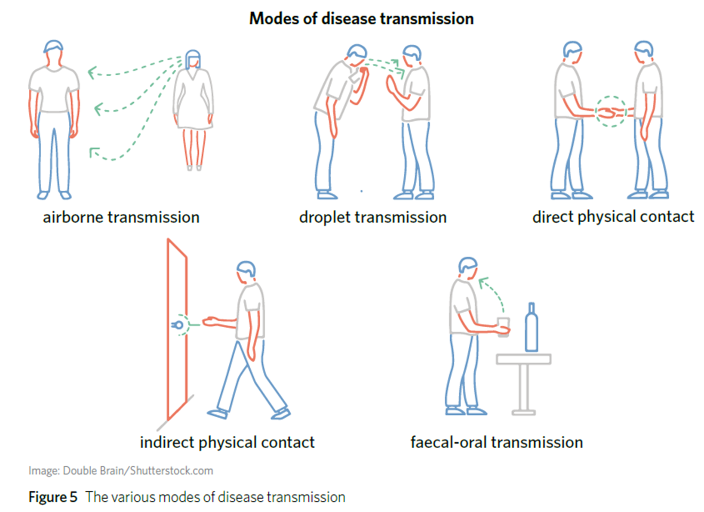

---
---
epidemic -less spread around than a pandemic
endemic - existing constantly in an area
zoonotic- a disease that transferred between animals and humans

**Airborne** - particles staying in air after sneezes, coughs, exhales, talks etc
**Droplet transmission** - respiratory droplets on surfaces (also in air, but don't travel as far)
**Direct physical contact** - includes sharing of bodily fluids
**Indirect physical contact** - vectors or objects acting as vectors
**Faecal-oral transmission** - contamination of food or water by infected faeces, or airborne/droplets when toilet flush

just a general understanding.

