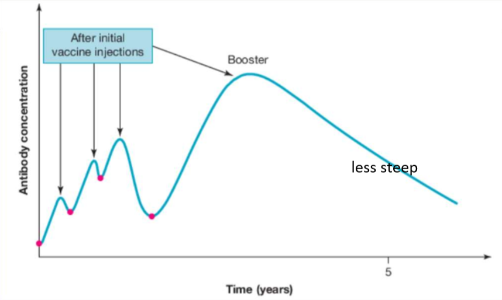

---
---
#### Vaccines
- Medical treatment (antigenic substance) prepared from the causative agent of a disease (or synthetic substitute) 
- **Artificial active** immunity, provides **specific adaptive** immune response and provide immunological **memory** (produce memory cells) against disease.

**How do vaccines produce memory cells** (vcaa question)
Vaccine antigens engulfed by antigen presenting cells, travel to lymph nodes + release cytokines, attracting naive helper T cells.  
Naive helper T cells with complementary receptor to antigen bind and are activated by cytokines.  
Antigens bind to the B‑cell receptor (BCR) on naïve B cells and is internalised via endocytosis and presented on MHC II.  
Helper T cells recognise and bind to antigen‑MHC II complex, release cytokines, triggering clonal selection and clonal expansion.  
B cells proliferate and differentiate into plasma cells and memory B cells - which remain in the lymphoid tissue for a long time (years) to rapidly produce a larger amount of antibodies upon reexposure

Virulence:
- how damaging the pathogen is

| Type of vaccine | Contents of vaccine                                                        | Pros                                                                                                           | Cons                                                                                                     |
| --------------- | -------------------------------------------------------------------------- | -------------------------------------------------------------------------------------------------------------- | -------------------------------------------------------------------------------------------------------- |
| Live attenuated | Lab grown pathogens with reduced virulence (unlikely to cause disease)     | Closest to natural infection, lifelong immunity with 1-2 doses                                                 | sometimes could mutate into virulent form. Also people with eg weakened immune systems cannot receive it |
| Toxoid          | Lab altered toxin produced by a pathogen that can no longer cause disease  | no reversion to virulent state, stable and long lasting so easier to store                                     | usually requires adjuvant and several doses                                                              |
| Inactivated     | Inactivated/destroyed lab grown pathogens through chemicals/heat/radiation | Many different antibodies produced (many antigens) safer for people w/ weak immune systems, easier to store | relatively weak; boosters required                                                                       |
| Subunit         | Parts of pathogens that can induce adaptive immune response, eg an antigen | Many different antibodies produces (many antigens), safer for people w/ weak immune systems, easier to store   | relatively weak; boosters required                                                                       |
Boosters amplify antibody responses, creating many memory cells

*source: unknown*

**why boosters** (vcaa question)
1. memory cells and antibodies *decline in number over time*
2. leading to a smaller response upon reinfection, which may result in harm or symptoms.
3. A booster will trigger an immune response, leading to production of more antibodies and more memory cells.
4. these memory T and B cells remain in the lymphoid tissue long after infection is resolved, ready to quickly *proliferate and act* if reinfected
5. Produce a larger and faster response, and *reduced symptoms*

##### Herd immunity
When a critical portion of a community is immunized/vaccinated against a contagious disease, most members of the community are protected against that disease due to reduced transmission (reduced available hosts).

(protects immunocompromised + those who cannot get vaccinated eg...)
infants, pregnant women, or immunocompromised individuals—get some protection because the spread of contagious disease is contained.

**Difference between natural and artificial in immunity**  
- Immune response is stronger and longer lasting in actual virus  
- sometimes vaccines due to weaker response require booster shots  
- Immune system is exposed to a wider range of antigens (natural)