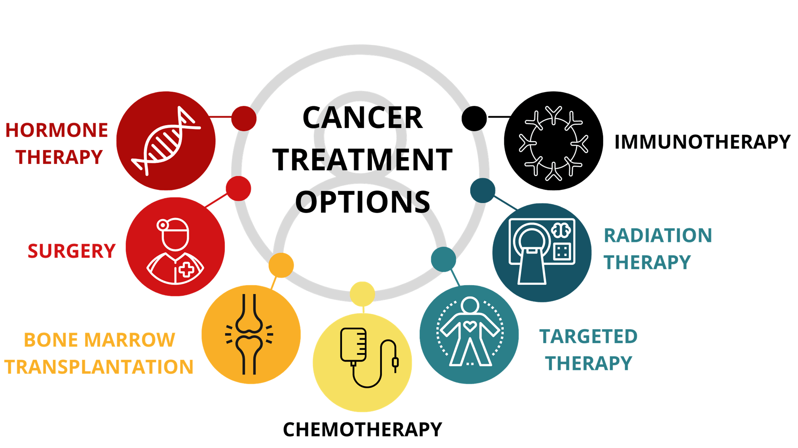

---
---
#### Immunotherapy
- **medical treatments that treat disease by activating or suppressing the immune response**
-Activation immunotherapies – aim to induce or amplify an immune response

-Suppression immunotherapies – aim to prevent or reduce an immune response

##### Monoclonal antibodies
- used in antibody therapy, a type of immunotherapy
- Antibodies produced in the laboratory that bind to a specific antigen
- they can be used to treat cancer and autoimmune diseases due to their ability to trigger the killing of cancerous or self-recognising cells respectively

Steps
1. identify + isolate antigen on target cell e.g. cancer cell
2. Inject an animal (mouse) with the antigen, stimulates immune response (repeat injections may be given to increase B cells)
3. B cells extracted from the **spleen** of the animal
4. B cells are fused w/ rapidly-dividing cancerous human plasma cells (myeloma cells) -> hybridised -> called hybridoma
5. Hybridomas are screened so only the cells relevant to the specific antigen remain. Then grown -> mass production of specific antibodies
6. Antibodies collected and purified, administered to patients.
![[../../assets/fa157a6d050ce58dc75626432b6f285132979d363d3b06255dca4efb298be1b2699d0d4693ad80effeca78045b904d8d8bd566711a58f0bc78e9283d77ff09ac.png]]
*source: S W Michnick & S S Sidhu, Nature chemical biology 2008 *

naked monoclonal antibodies (unconjugated): not attached to any molecule (eg radioactive particle or drug)
Just say "B cell" don't need to say exactly what type

##### Cancer
- disease
- own body cells growing uncontrollably, ability to migrate to other parts of the body
- normally genes will identify growing out of control and induce apoptosis, however cancer cells has a resistance to this
- can be genetic or caused by damage to the DNA
- Substances that damage DNA are called carcinogens (e.g. radiation, viruses)

##### Tumors
- When the number of abnormal cells increases significantly forming a clump of cells. Not all tumours are cancerous.
- Benign tumours – localised masses. Can become cancerous.
- Malignant tumours – cancerous because their cells can spread + invade nearby tissue
- Metastasis – occurs when cancerous cells break away from the original (primary) tumour, travel through the blood and lymph vessels, and form secondary tumours at other locations

We only need to know immunotherapy (don't need to know other options, just understand where immunotherapy sits)