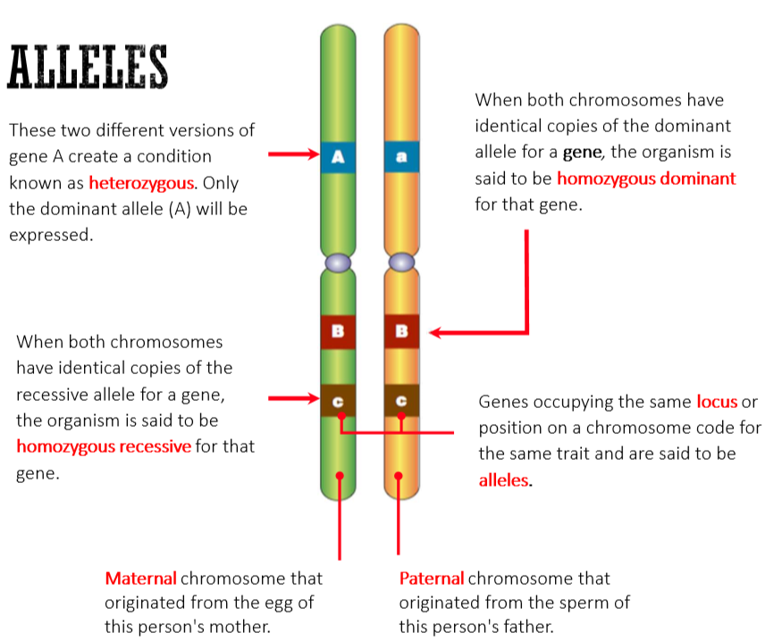
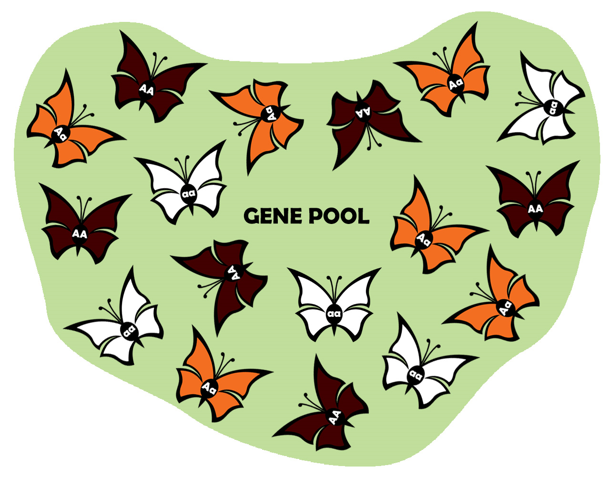

---
---
**Quick recap:**
Genotype vs phenotype

Haploid - half the full set of chromosomes, in gametes
Diploid - full set, in somatic cells

autosome - a non sex chromosome

Gene:
**A sequence of  dna that codes for a specific protein**
### Chromosomes

Homologous
- the two similar chromosomes from each parent (eg thare are 46 pairs of homologous chromosomes in humans)

Telomere
- the end of a chromosome
- contains thousands of repeating base pairs to prevent chromosomes sticking together and enable replication

### Alleles
Genes occupying the same position (locus) on homologous chromosomes

versions of the same gene that code for a variant of the same polypeptide.

There are two alleles per gene (one from each parent)

There may be more than two alleles in a population, e.g blood groups A, B, O.

When 3 or more alleles exist for a gene, the gene is said to have Multiple Alleles and is termed POLYMORPHIC (discontinuous variation)

A single characteristic controlled by multiple genes is called POLYGENIC INHERITANCE (Continuous variation)

**Codominant**
- the flower will be pink (both red and white)

### Gene pool
total **genes** (+ **alleles**) in a **population** at one time

##### Analyzing a gene pool
- determine the state of a gene pool (stable or undergoing change)
 - frequency of an allele = # of the allele as a fraction out of total population

