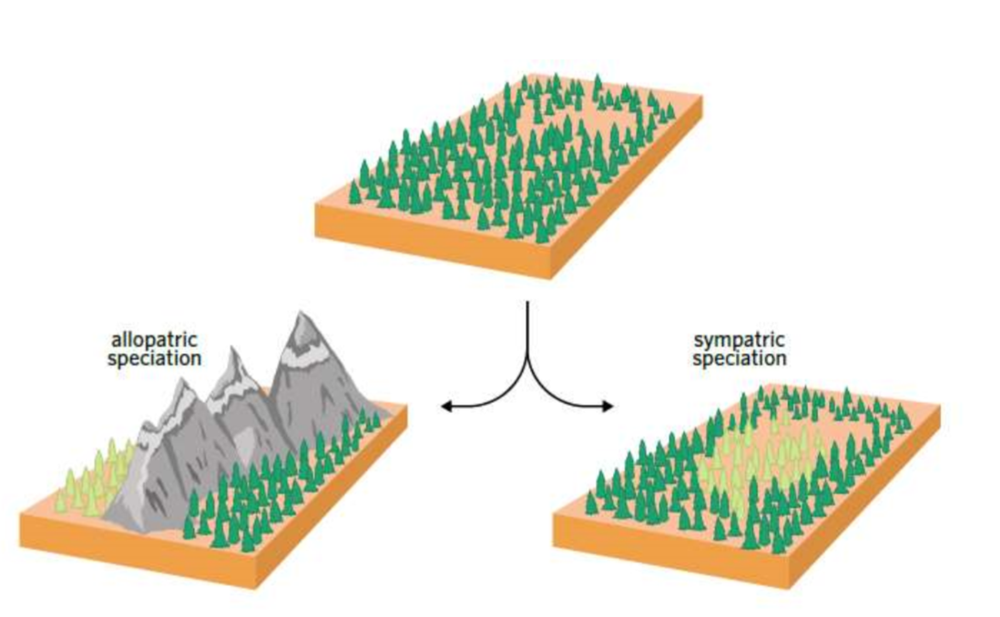
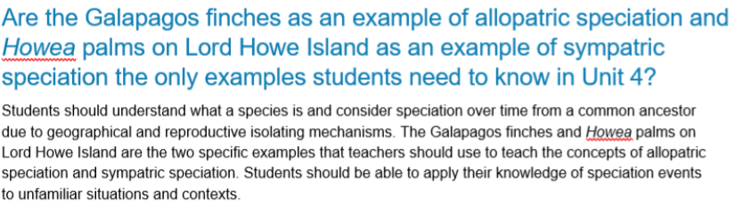

---
---
- formation of **new species** by splitting a single population's lineage into two or more genetically independent populations that [species def]
- **selection pressures** act on different **phenotypes**
- basically "attaining species status"

*source: unknown*

*source: vcaa*