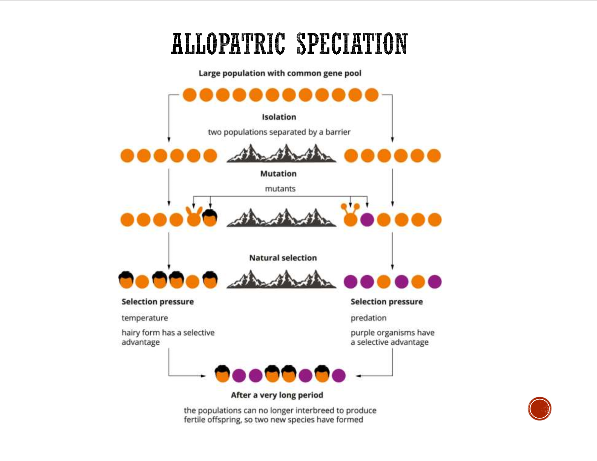

---
---
Darwin's finches (example)

- example of allopatric speciation (specifically **adaptive radiation**)
- adaptive radiation is the **rapid allopatric speciation from a common ancestor** which results in the different species filling different ecological niches  

summary
seeing similar looking birds on galapagos islands (isolated group of volcanic islands), but small differences (adapted to different environmental selction pressures on each island (the availability of different food sources; beak shape)).

1. different islands - different bird beak shape
2. due to different environmental pressure (the food type available)
3. this is due to them not interbreeding (because of barrier) allowing the divergent evolution caused by the food

VBSIS (vcaa response structure) (also for sympatric speciation)

**Variation** (in alleles for [the trait] in original gene pool)

**GEOGRAPHICAL Barriers** (stop gene flow -> reproductive isolation)
- Species spread out (eg competition), barriers form (eg sea level) between
- also mutates differently from original population -> more variation

**Selective** pressures (state what it is) varied in each environment

**Inheritance** (of traits that are at a selective advantage in each population and accumulation of genetic differences (**mutations accumulate**) in each population)

**Speciation** (due to **reproductive isolation** occurs when the different populations/species are brought back together and they cannot produce viable and fertile offspring.) (are thus different species)

**How did the finches speciate in the Galapagos islands**
A single finch population existed with naturally occuring variation  
  
The finch populations on separate islands in the Galapagos were geographically isolated by the ocean preventing gene flow between populations  
  
DIfferent selection pressures (food availability) act on the finches on different islands, selecting for different phenotypes (beak shape, size etc) by natural selection  
  
Allele frequencies change and differ between groups due to mutations and different selected phenotypes make a greater contribution to gene pool  
  
Over generations, populations of finches genetically diverge due to the accumulation of genetic differences and can no longer interbreed to produce viable fertile offspring - are thus different species