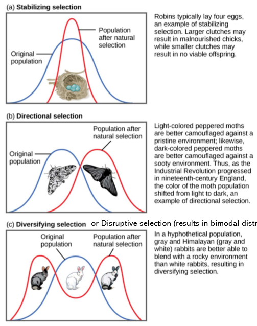

---
---
random mating - all genotypes have equal chance of reproductive success

non random (sexual selection)
- mating with close neighbours or those most similar to themselves

**Environmental selection pressures**
- "from the environment {present in each separated population} which **acts on PHENOTYPES** and impacts survival"
- causes natural selection
__
- eg competition (intra & inter specific), predation, disease, climate change
- eg antibiotic resistance

PHYSICAL AGENTS
- Climate, temperature, food availability, drought

BIOLOGICAL AGENTS
- Infectious diseases, predators, competitors, food source (eg: Darwins finches)

CHEMICAL AGENTS
- Pollutants, pesticides

---
Phenotypes selected against (therefore not common in gene pool) is said to be "less fit". Unfavourable for survival

(and vice versa)
key word **retained**

favourable
fit
retained
advantageous
selected for

presence of additional **allele** in the **gene pool** will increase the **genetic diversity** of population

*source: https://bioprinciples.biosci.gatech.edu/module-1-evolution/evolution-by-natural-selection-2/*