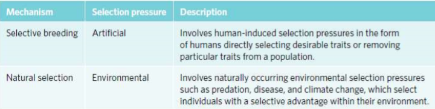

---
---
<mark>when asked for what type of selection must say artificial selection, not selective breeding</mark>

- breeding individuals with the most desirable phenotypes
- more **rapid** and **intense** than those occuring in nature
- can lead to smaller **gene pools**, reduced adaptability **and** overexpression of "unfit" genes **passed on**
- eg high wool density in sheep

