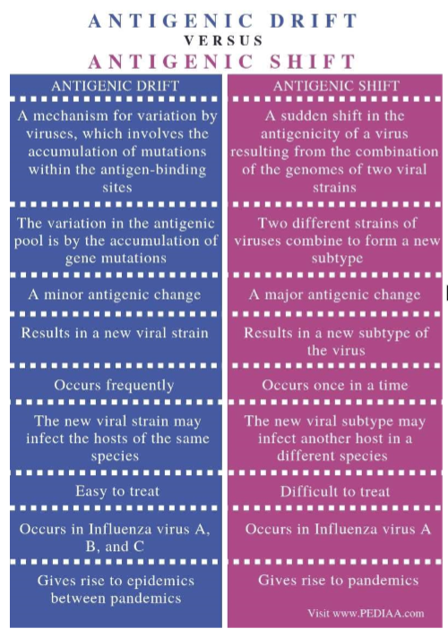
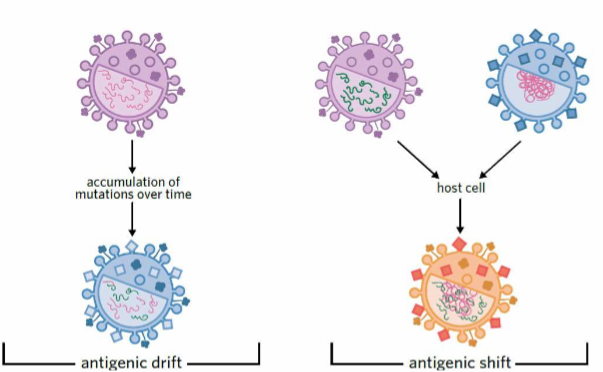

---
---
Viral antigenic drift and shift in terms of ongoing challenges for treatment strategies and vaccination against pathogens

**implications of antibiotic resistance for health + global population**
difficult to find antibiotics that particular strains of bacteria are not resistance to  
  
Bacterial resistance develops quickly as only resistance bacteria survive to reproduce and resistance can be passed on through conjugation even to other species  
  
Difficult to find new antibiotics so other avenues such as CRISPR Cas9 and bacteriophage therapy must be investigated which requires time and money  
  
Hospitals/care facilities may not have access to antibiotics that strains are susceptible to, leading to deaths  
  
epidemics and pandemics more likely as diseases are harder to treat

**Explain how antigenic drift/shift can result in loss of immunity**
The original vaccine or exposure to influenza will have enabled a person to produce antibodies / memory cells against the antigens (proteins) on the surface of the virus.  
When the antigen shape changes, the person's antibodies may not be complementary / able to bind at all to the new virus antigen. This results in the loss of immunity to the virus.

**consequences of antigenic drift**
Consequence  
- partial/loss immunity
- antibodies might not bind
- someone previously vaccinated may no longer be immune 
- challenge for vaccine development, can lead to providing vaccine for wrong strain
- can cause epidemics  
- Need new vaccine every year as a result