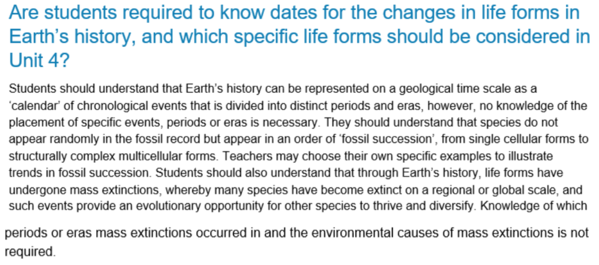
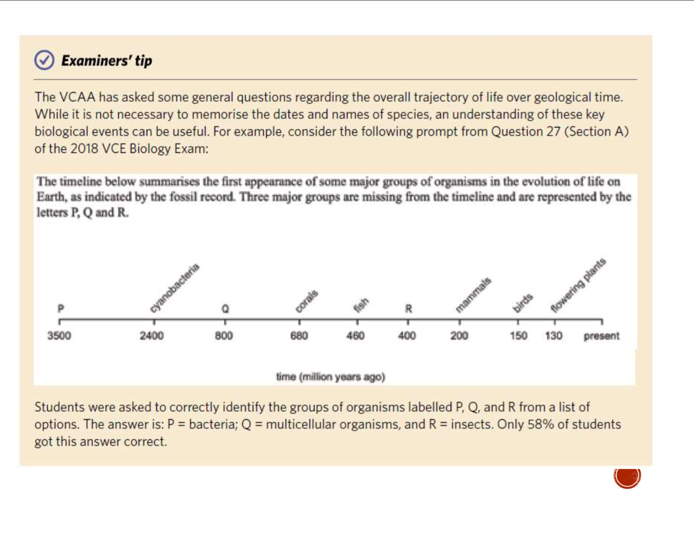

---
---
#### Fossils
**Preserved remains of an organism / direct evidence of its presence**

Geological time scale
- constructed using the order of rocks (oldest at bottom), and the fossilized remains in these rocks

Evidence of changes:
- fossil record
	The total number of fossils that have been discovered, provides evidence for evolution through geological time
	- faunal (fossil) succession
	- index and transitional fossils
	- relative and absolute dating of fossils

### Dating fossils
- relative dating (older, younger)
	- based on stratigraphy (relative positions of rock layers)
	- can be difficult where rocks have eroded, buckled, moved reburied
	- Index (indicator fossils) used.
- absolute dating (_ years ago)
	- eg radiometric dating

*source: vcaa*
