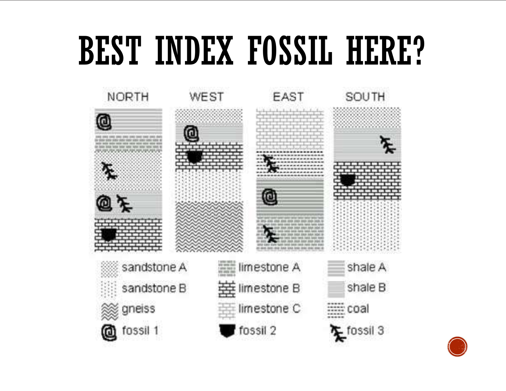
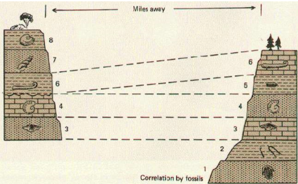

---
---
**How do fossils provide evidence for evolution/species changing over time**
- show structural differences in organisms preserved in older versus younger rock strata, revealing gradual changes in form.
- Transitional fossils def

### Transitional fossils
provide evidence for an **intermediate evolutionary form** between ancestor and its descendants
- has common traits between both groups
- eg archaeopteryx - evidence for dinosaur-bird transition
	- dinosaur's long bony tail
	- bird's featherss

### Index fossils
a fossil which an absolute age has been determined that is used to define and identify geological periods.
- physically distinctive- easily recognisable
- have had a large population
- existed in many geographical areas
- only lived within a known short period of time

answer: fossil 2

## Stratigraphy
- **"fossils contained in sedimentary rock strata succeed one another in a predictable order, even when found in different places"**
- when same sequence of fossils is found at another location, it is likely that the rock strata containing them are from the same **geological time**

*source: (not original source) https://www.quia.com/jg/3115051list.html*

**Limitation of stratigraphic method**
rock strata can shift positions due to **tectonic movement**, volcanic eruptions, **earthquakes**, making it difficult to determine a relative age