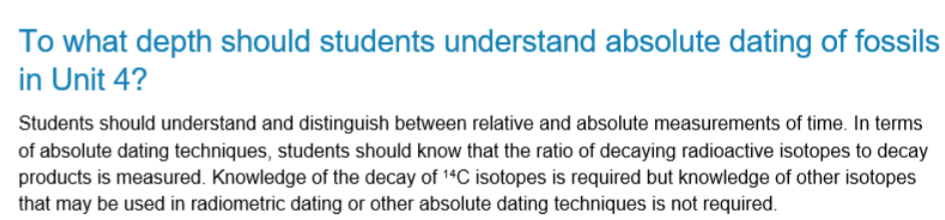

---
---
- more precise estimate of age of object
- eg
	- radiometric
	- thermoluminescence
	- electron spin resonance
There will be maths question on this (know how to **double**)

*source: vcaa*

Radiometric Dating
- **radioisotope** - **unstable** form of an element
	- eg carbon 14 - can spontaneously break down into nitrogen 14 whilst emitting radiation
- **half life** - time taken for half of the element to decay
	- can be used to calculate age of the rock or fossil it was in
	- eg 2 half lives = 25% remaining
- only works for things that were once organic (contained carbon) ie. something from an organism, or things that contained uranium (shells, corals)
- can only date ingenious rock (solidified molten rock), not sedimentary rock

**Half lives**

|           | turns into  | half life          |                     |
| --------- | ----------- | ------------------ | ------------------- |
| carbon 14 | Nitrogen 14 | 5730 years         | max 60k old samples |
| uranium   | lead        | millions, billions |                     |

