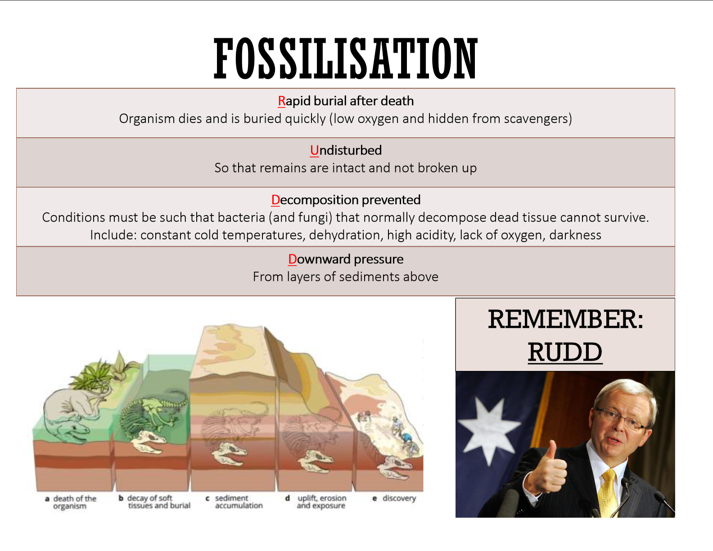
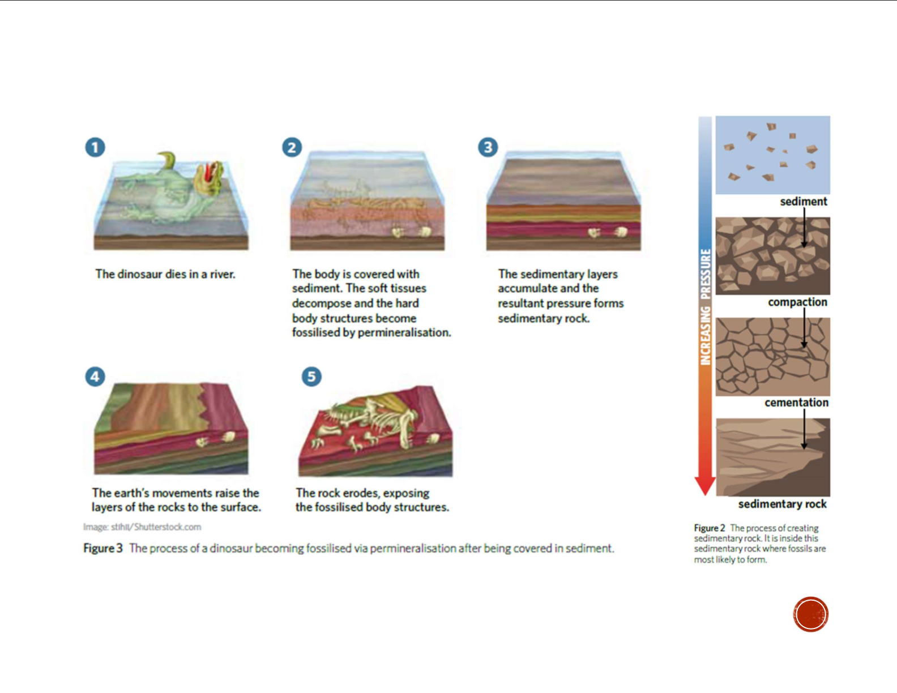

---
---
Organism dies and is **rapidly buried**/covered by sediments  
  
The organism is **undisturbed** by scavengers/decomposers keeping remains intact  
  
conditions like anoxia, low oxygen, cold temps, alkalinity, darkness, prevent decomposers like bacteria and fungi from surviving to **decompose** the organism  
  
Sediments are further deposited causing **downward pressure** that compresses original sediment layer to become sedimentary rock  
  
Fossil is exposed by **erosion, uplift, excavation**

**Make sure you apply it to the context (what led to the discovery is one of the marks)**

##### **Optimal conditions for fossilization**
- **lack of decomposers and scavengers**
- **low winds**
- **darkness**

**Locations**
- **amber/ice**
- **dry caves w/ cool + constant temp**
- **wetlands and tar pits**
- **not ripped apart by a river**
- **underwater**

**Why marine animals more often fossilised**
- rapidly buried by sediments carried by water currents, protecting them from scavengers.
- The floor of water bodies has a greater movement of sediments than land. 
- cold, dark, low oxygen- reduced decomposition by bacteria and fungi